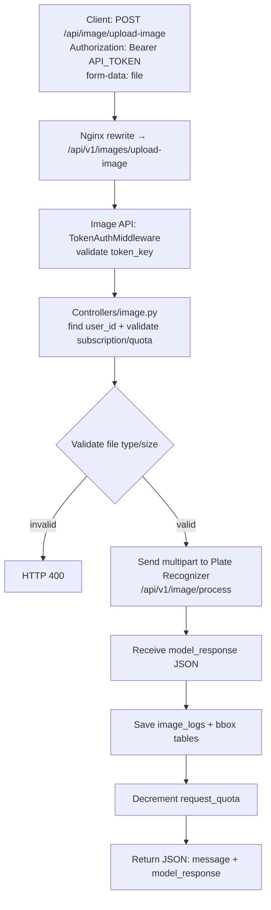
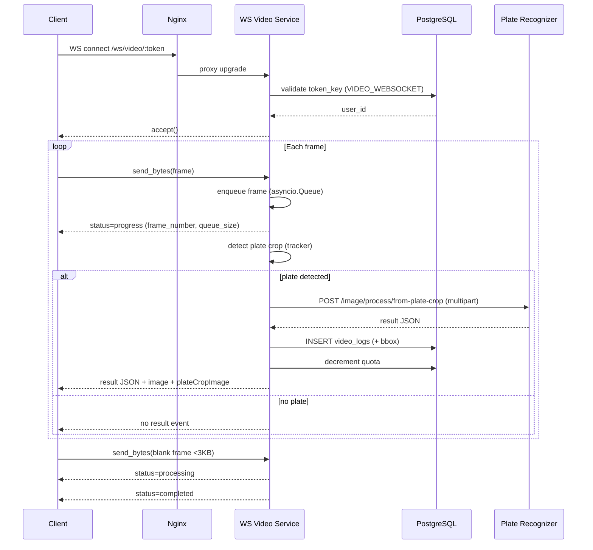
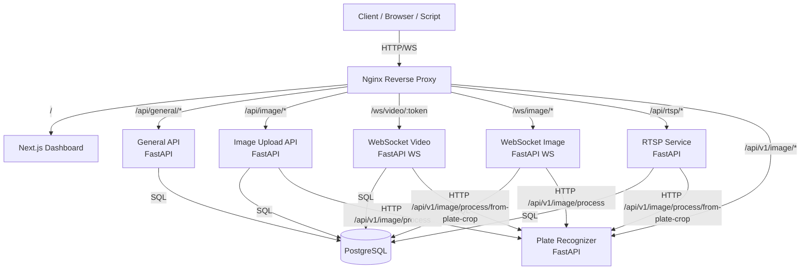

# CE68-15 Automatic License Plate Recognition Service Version 2 - Developer Manual

> เอกสารคู่มือสำหรับนักพัฒนา (ส่วนเสริมปริญญานิพนธ์) — อธิบายโครงสร้างโปรแกรมแบบ Top-Down, ความสัมพันธ์ของโมดูล, อินเทอร์เฟซระหว่างบริการ, และพารามิเตอร์ที่ใช้ในการสื่อสาร พร้อม Diagram/Flowchart

**โครงงาน:** ALPR-V2 (Automatic License Plate Recognition)  
**สถาปัตยกรรม:** Microservices + Nginx Reverse Proxy + PostgreSQL  
**ภาษา/เฟรมเวิร์กหลัก:** Python (FastAPI), TypeScript (Next.js)  
**วันที่จัดทำ:** 2026-04-03

---

## สารบัญ

1. ภาพรวมระบบ (System Overview)
2. โครงสร้าง Repository และจำนวนไฟล์
3. การแบ่งโปรแกรมย่อย (Subprograms/Microservices)
4. อินเทอร์เฟซและการส่งพารามิเตอร์ระหว่างบริการ (I/O Contracts)
5. โครงสร้างภายในแต่ละบริการ (Modules & Key Files)
6. Flowchart / Diagram
7. แนวทางสำหรับนักพัฒนา (Dev Workflow, Testing)

---

## 1) ภาพรวมระบบ (System Overview)

ALPR-V2 เป็นระบบอ่านป้ายทะเบียนแบบอัตโนมัติ โดยแยกเป็นหลายบริการ (microservices) เพื่อให้พัฒนา/ปรับขนาด/ดีบักได้เป็นส่วน ๆ โดย Nginx ทำหน้าที่เป็น Reverse Proxy และเส้นทางเข้าออกหลักของระบบ

### 1.1 ภาพรวมความสัมพันธ์ระดับระบบ

- Client (Browser/Script) เรียก API หรือ WebSocket ผ่าน Nginx
- General API ดูแลผู้ใช้, JWT, token ของบริการ, subscription/quota
- Image API รับอัปโหลดรูปแบบ HTTP (ต้องใช้ token ของบริการประเภท API)
- WebSocket Video รับ frame แบบ byte stream (ต้องใช้ token ของบริการประเภท VIDEO_WEBSOCKET)
- RTSP Service จัดการกล้อง, อ่านสตรีม RTSP, ส่งภาพให้ AI, เก็บ log และส่งภาพ/ผลลัพธ์ให้ผู้ชมผ่าน WebSocket
- Plate Recognizer เป็น AI Inference Engine (ตรวจจับป้าย + OCR + จังหวัด)
- PostgreSQL เก็บข้อมูลผู้ใช้/โควตา/Token/Logs

---

## 2) โครงสร้าง Repository และจำนวนไฟล์

> หมายเหตุ: Repository มีไฟล์จำนวนมากจาก `node_modules/`, artifacts, และข้อมูลโมเดล/สื่อ จึงสรุป “จำนวนไฟล์ทั้งหมด” และ “จำนวนไฟล์เชิงซอร์ส (กรอง build artifacts ออก)” แยกกัน

### 2.1 จำนวนไฟล์โดยสรุป

- จำนวนไฟล์ทั้งหมดทั้ง repo (รวม node_modules/artifacts): **61,299** ไฟล์
- จำนวนไฟล์ที่ “กรอง build artifacts” (ตัด node_modules/.next/dist/htmlcov/cache ฯลฯ): **18,357** ไฟล์

### 2.2 จำนวนไฟล์เชิงซอร์ส (Source-focused)

(นับเฉพาะไฟล์ที่เกี่ยวกับการพัฒนาโดยตรง)

- Python (.py) ภายใต้ `alpr_service/`: **137** ไฟล์
- Next.js TS/TSX ภายใต้ `alpr_service/alpr_web/src/`: **100** ไฟล์

### 2.3 จำนวนไฟล์ Python ต่อบริการ (โดยประมาณ)

- General API (`alpr_service/alpr_general_api`): **32** ไฟล์ .py
- Image API (`alpr_service/alpr_api_image`): **19** ไฟล์ .py
- WebSocket Video (`alpr_service/alpr_websocket_video`): **19** ไฟล์ .py
- RTSP Service (`alpr_service/alpr_rtsp_service`): **25** ไฟล์ .py
- Plate Recognizer (`alpr_service/plate_recognizer`): **26** ไฟล์ .py
- WebSocket Image (`alpr_service/alpr_websocket_image`): **14** ไฟล์ .py

> วิธีนับ: ใช้คำสั่ง PowerShell (exclude `node_modules/.next/htmlcov/__pycache__/.pytest_cache` ฯลฯ)

---

## 3) การแบ่งโปรแกรมย่อย (Subprograms / Microservices)

โปรแกรมย่อยหลักของระบบ (ตาม `alpr_service/docker-compose.yml`)

| โปรแกรมย่อย         | โฟลเดอร์                             | Entrypoint   | โปรโตคอล  | Public Path (ผ่าน Nginx)                          | Auth                    | Output หลัก                    |
| ------------------- | ------------------------------------ | ------------ | --------- | ------------------------------------------------- | ----------------------- | ------------------------------ |
| Nginx Reverse Proxy | `alpr_service/`                      | `nginx.conf` | HTTP/WS   | `/` `/api/*` `/ws/*`                              | -                       | reverse proxy / routing        |
| Web Dashboard       | `alpr_service/alpr_web/`             | Next.js      | HTTP      | `/`                                               | JWT (เรียก General API) | UI + เรียก API อื่น ๆ          |
| General API         | `alpr_service/alpr_general_api/`     | `main.py`    | HTTP      | `/api/general/*`                                  | JWT (Bearer)            | user/token/subscription        |
| Image Upload API    | `alpr_service/alpr_api_image/`       | `main.py`    | HTTP      | `/api/image/*`                                    | Service Token (Bearer)  | log + quota + model_response   |
| WebSocket Video     | `alpr_service/alpr_websocket_video/` | `main.py`    | WS + HTTP | `ws://.../ws/video/:token`                        | Service Token (path)    | ส่งผลลัพธ์เป็น JSON ผ่าน WS    |
| RTSP Service        | `alpr_service/alpr_rtsp_service/`    | `main.py`    | HTTP + WS | `/api/rtsp/*` และ `ws://.../api/rtsp/stream/{id}` | RTSP token (body)       | stream status + detection logs |
| Plate Recognizer    | `alpr_service/plate_recognizer/`     | `main.py`    | HTTP      | `/api/v1/image/*`                                 | ไม่มี (internal API)    | {plate_id, province, bbox}     |
| PostgreSQL          | (container)                          | -            | TCP       | (internal)                                        | DB credentials          | persistent storage             |

---

## 4) อินเทอร์เฟซและการส่งพารามิเตอร์ระหว่างบริการ (I/O Contracts)

ส่วนนี้เน้น “พารามิเตอร์ที่ใช้ติดต่อกัน” และรูปแบบ Input/Output ของโปรแกรมย่อย

### 4.1 Token ที่ใช้ในระบบ (สำคัญ)

ระบบมี token 2 กลุ่มหลัก

1. **JWT (General API)**

- ได้จาก `POST /api/general/auth/login`
- ใช้เรียก endpoint ที่ต้องการ user identity เช่น `GET /api/general/auth/me`
- ส่งผ่าน Header: `Authorization: Bearer <jwt>`

2. **Service Token (Token Key ในตาราง token)**

- ถูกสร้าง/จัดการผ่าน General API `/tokens*`
- แบ่งตาม service_type เช่น `API`, `VIDEO_WEBSOCKET`, `RTSP`
- ใช้เรียก Image Upload API / WebSocket Video / RTSP Service

---

### 4.2 Plate Recognizer API (AI Inference)

**Base path (ผ่าน Nginx):** `/api/v1/image/*`  
**Internal router prefix:** `/api/v1/image` (ใน `plate_recognizer/main.py`)

#### 4.2.1 POST `/api/v1/image/process`

- **Input:** `multipart/form-data`
  - `file`: UploadFile (JPEG/PNG)
- **Output:** JSON
  - `plate_bbox`: จุด 4 มุมของ bbox
  - `plate_id`: ข้อความป้าย
  - `province`: จังหวัด
  - `full_plate`: รวมข้อความ
  - `format_flag`: `complete|warning|...`

#### 4.2.2 POST `/api/v1/image/process/skip/car`

- **Input:**
  - `multipart/form-data` + JSON body
  - `car_bbox` (Body): List[float] เช่น `[x1,y1,x2,y2]`
  - `file`: UploadFile
- **Output:** JSON โครงสร้างเดียวกับ `/process`

#### 4.2.3 POST `/api/v1/image/process/from-plate-crop`

- **Input:** `multipart/form-data` (รูปที่ crop เฉพาะป้าย)
- **Output:** JSON (ไม่จำเป็นต้องมี car_bbox)

---

### 4.3 Image Upload API (HTTP Upload + Quota + Logging)

**Public path (ผ่าน Nginx):** `POST /api/image/upload-image`  
**Nginx rewrite:** `/api/image/* → /api/v1/images/*`  
**Internal router prefix:** `/api/v1/images` (ใน `alpr_api_image/main.py`)

#### 4.3.1 POST `/api/image/upload-image`

- **Input**
  - Header: `Authorization: Bearer <API_TOKEN_KEY>`
  - Body: `multipart/form-data`
    - `file`: รูปภาพ (JPEG/PNG)
- **ขั้นตอนหลัก (สรุป):**
  1. validate token (middleware) + หา user_id จาก token
  2. ตรวจ subscription + quota
  3. ตรวจชนิดไฟล์ + ขนาด (max 50MB ในโค้ด controller)
  4. ส่งรูปไป Plate Recognizer: `http://plate-recognizer:5000/api/v1/image/process`
  5. บันทึก log ลง PostgreSQL และลด quota
- **Output:** JSON
  - `message`
  - `model_response` (ผลจาก Plate Recognizer)
  - `user_id`
  - `filename`

#### 4.3.2 Flowchart: HTTP Image Upload (Image API)



---

### 4.4 General API (Auth + Token + Subscription)

**Public path:** `/api/general/*`  
**Internal root_path:** `/api/general` (FastAPI `root_path`)

#### 4.4.1 Authentication

1. `POST /api/general/auth/register`

- **Input:** JSON `{ email, password }`
- **Output:** `{ user_id, email, message }`

2. `POST /api/general/auth/login`

- **Input:** JSON `{ email, password }`
- **Output:** `{ access_token, token_type, user_id, email, message }`

3. `GET /api/general/auth/me`

- **Input:** Header `Authorization: Bearer <JWT>`
- **Output:** `{ user_id, email, created_at, updated_at }`

#### 4.4.2 Token Management (Service Token)

1. `GET /api/general/tokens/{user_id}?service_type=API|VIDEO_WEBSOCKET|RTSP`
2. `POST /api/general/tokens` สร้าง token_key ใหม่
3. `PUT /api/general/tokens` แก้ไขชื่อ/วันหมดอายุ
4. `DELETE /api/general/tokens` ลบ token

#### 4.4.3 Subscription

- `GET /api/general/info/subscribe/{user_id}`: ดู subscription ของ user
- `GET /api/general/subscription/get_all_service`: ดู plan ทั้งหมด
- `POST /api/general/subscription/create_user_subscription`: ผูก subscription ให้ user

---

### 4.5 WebSocket Video (Streaming Frame → Detection)

**Public WebSocket URL:** `ws://<host>/ws/video/:token`  
**Token:** path parameter `:token` ต้องเป็น service_type = `VIDEO_WEBSOCKET`

#### 4.5.1 Input (Client → Server)

- ส่งภาพ “ทีละ frame” เป็น **binary message** (`websocket.send(bytes)`) โดยต้องเป็นไฟล์ภาพที่ decode ได้ (เช่น JPEG)
- เฟรมสุดท้ายส่ง **blank/เล็ก** (< 3000 bytes) เพื่อบอกจบ video upload

#### 4.5.2 Output (Server → Client)

- ระหว่างประมวลผล: ส่ง progress JSON
  - `{ status: "progress", frame_number, queue_size }`
- เมื่อเจอป้ายและอ่านได้: ส่ง JSON ผลลัพธ์จาก Plate Recognizer + ฟิลด์เพิ่ม
  - `filename` (ไฟล์ที่บันทึก)
  - `image` (full frame ที่ resize เป็น base64 data URL)
  - `plateCropImage` (plate crop base64 data URL)
- เมื่อรับ blank frame: ส่งสถานะ
  - `{ status: "processing", message: "Video upload complete, processing frames..." }`
  - สุดท้าย `{ status: "completed", message: "All frames processed" }`

#### 4.5.3 Sequence Diagram: WebSocket Video Processing



---

### 4.6 RTSP Service (Camera CRUD + Streaming Viewer)

**Public base (ผ่าน Nginx):** `/api/rtsp/*`  
**Nginx rewrite:** `/api/rtsp/* → /api/v1/*`  
**Internal router prefix:** `/api/v1` (ใน `alpr_rtsp_service/main.py`)

#### 4.6.1 HTTP Endpoints (ตัวอย่างสำคัญ)

- `GET /api/rtsp/cameras` : รายการกล้อง
- `POST /api/rtsp/cameras` : เพิ่มกล้อง (ต้องส่ง `token_key` RTSP)
  - Body JSON:
    - `name`, `rtsp_url`, `token_key`, `location?`, `enabled?`, `fps?`, `frame_skip?`
- `PUT /api/rtsp/cameras/{camera_id}` : แก้ไข
- `DELETE /api/rtsp/cameras/{camera_id}` : ลบ
- `POST /api/rtsp/cameras/{camera_id}/start` : เริ่ม stream
- `POST /api/rtsp/cameras/{camera_id}/stop` : หยุด stream

#### 4.6.2 WebSocket Viewer

- `ws://<host>/api/rtsp/stream/{camera_id}`
- Output:
  - message type `info` ส่งข้อมูลกล้อง
  - message type `frame` ส่งภาพ base64 (data URL)
  - message type `detection` ส่งผลการอ่านป้าย + รูปป้าย base64

---

## 5) โครงสร้างภายในแต่ละบริการ (Modules & Key Files)

ส่วนนี้อธิบายโครงสร้าง “แบบ Top-Down” โดยเริ่มจาก entrypoint → routers/controllers → models/configs/libs

### 5.1 Nginx Reverse Proxy

**ไฟล์หลัก**

- `alpr_service/nginx.conf` — กำหนด routing + rewrite + WS upgrade

**แนวคิดสำคัญ**

- `/api/general/*` → rewrite เป็น `/api/v1/*` แล้วส่งไป General API
- `/api/image/*` → rewrite เป็น `/api/v1/images/*` แล้วส่งไป Image API
- `/ws/video/*` → upgrade เป็น WebSocket และ proxy ไป WebSocket Video
- `/api/rtsp/*` และ `/api/rtsp/stream/*` → proxy ไป RTSP service

---

### 5.2 General API (`alpr_service/alpr_general_api`)

**Entrypoint**

- `main.py` — สร้าง FastAPI app, ตั้ง `root_path="/api/general"`, include routers

**โมดูลหลัก (directories)**

- `Controllers/` — endpoint layer (APIRouter)
  - `auth.py` — register/login/me/logout
  - `token.py` — CRUD token ของบริการ
  - `subscription.py` — plan และ user subscription
  - `info.py` — ดึงข้อมูล user/subscription
- `Models/` — SQLAlchemy models + Pydantic schemas
- `Configs/` — DB connection / session (`dbconfig.py`)
- `Libs/` — JWT utilities (`auth.py`), error helpers
- `Test/` — unit tests

**การแบ่งโมดูลในเชิงตรรกะ**

1. Auth Module (JWT): hash password, create/validate JWT
2. Token Module (service tokens): token_key + expire_time + service_type
3. Subscription Module: ควบคุมสิทธิ์และ quota ที่แต่ละบริการใช้งานได้

---

### 5.3 Image Upload API (`alpr_service/alpr_api_image`)

**Entrypoint**

- `main.py` — FastAPI app + `root_path="/api/image"` + include router `/api/v1/images`

**โมดูลหลัก**

- `Middlewares/token_auth.py` — ตรวจ `Authorization: Bearer <token_key>` และแนบ DB session ใน `request.state.db`
- `Controllers/image.py` — endpoint `POST /upload-image` + call Plate Recognizer
- `Models/` — token/users/subscription/logs/bbox schemas
- `Libs/utilitys.py` — utility ส่งรูปไป model (บางส่วน)

**Input/Output ภายในบริการ**

- Input: UploadFile + token_key
- Output: JSON + บันทึก log ลง DB + ลด quota ใน `UserSubscription.devalue_user_quota`

---

### 5.4 Plate Recognizer (`alpr_service/plate_recognizer`)

**Entrypoint**

- `main.py` — include router `handlers/image.py` ภายใต้ `/api/v1/image`

**โมดูลหลัก**

- `handlers/image.py` — นิยาม endpoint `/process*`
- `models/image_processor.py` — pipeline หลัก (Top-Down)
  - `PlateDetector → PlateSplitter → ProvinceClassifier + CTCOCRReader`
- `models/localizers.py` (และไฟล์ที่เกี่ยวข้อง) — ตัวเรียกโมเดลตรวจจับ/จำแนก
- `constants/` — config และ enum เช่น `format_flag`
- `libs/` — image utils, logging

**Output Contract สำคัญ**
ทุก endpoint ของ plate_recognizer ส่งผลในรูปแบบ dict เดียวกัน เช่น

- `plate_id`, `province`, `full_plate`, `plate_bbox`, `format_flag`, `message`

---

### 5.5 WebSocket Video (`alpr_service/alpr_websocket_video`)

**Entrypoint**

- `main.py` — WebSocket route `/{token}` เรียก `src/handlers/video.py`

**โมดูลหลัก (ภายใต้ src/)**

- `handlers/video.py` — รับ frame bytes จาก WS, validate, enqueue
- `utils/consumer.py` — consumer loop ดึง frame จาก queue → detect plate crop → call plate_recognizer → save log → ส่ง JSON กลับ
- `services/database.py` — validate token (VIDEO_WEBSOCKET), save video_logs, ลด quota
- `services/plate_recognizer.py` — HTTP client ไป plate_recognizer
- `models/tracker.py` — state/tracking ของการตรวจจับใน video
- `constants/configs.py` — WS_MAX_SIZE, PLATE_RECOG_BASE_URL, DB credentials

**แนวคิดสำคัญ**

- แยก producer/consumer ด้วย `asyncio.Queue` เพื่อให้รับเฟรมได้ต่อเนื่อง และประมวลผลแยก thread
- ใช้ “blank frame” เป็นสัญญาณจบการส่งข้อมูล

---

### 5.6 RTSP Service (`alpr_service/alpr_rtsp_service`)

**Entrypoint**

- `main.py` — FastAPI app `root_path="/api/rtsp"` และ include router `src/handlers/rtsp_handler.py` ภายใต้ `/api/v1`

**โมดูลหลัก**

- `src/handlers/rtsp_handler.py` — CRUD กล้อง + WebSocket viewer + loop ประมวลผล detection
- `src/services/*` — CameraManager, PlateRecognizerService, DatabaseService, DB functions
- `static/viewer.html` (ถ้ามี) — หน้า viewer แบบ static

**การส่งพารามิเตอร์**

- สร้างกล้องด้วย `token_key` (RTSP token) ใน body
- บริการเรียก plate_recognizer โดยใช้ `/process/from-plate-crop` เพื่อประหยัดเวลาตรวจจับซ้ำ (เมื่อมี plate crop แล้ว)

---

### 5.7 Web Dashboard (`alpr_service/alpr_web`)

**ภาพรวมโครงสร้าง (Next.js App Router)**

- `src/app/` — routes หลัก เช่น `login/`, `register/`, `dashboard/`
- `src/modules/` — feature modules (เช่น token management, upload, rtsp)
- `src/api/` — API client layer
- `src/shared/` — shared UI/components/utils

**หน้าที่หลัก**

- เรียก General API เพื่อ login/รับ JWT
- เรียก Token APIs เพื่อสร้าง token_key สำหรับใช้งานบริการอื่น
- เรียก Image Upload / WebSocket Video / RTSP CRUD

---

## 6) Flowchart / Diagram

### 6.1 Component Diagram (ภาพรวมบริการ)



---

## 7) Database (ตารางสำคัญ + ความสัมพันธ์)

ตารางหลักในฐานข้อมูล (จาก `alpr_service/dump.sql`)

- `users` — บัญชีผู้ใช้
- `subscription` — plan ของระบบ (tier/features)
- `user_subscription` — subscription ของแต่ละ user + `request_quota`
- `token` — token_key สำหรับเรียกบริการ (API/VIDEO_WEBSOCKET/RTSP)
- `image_logs` — log การอัปโหลดรูป (Image API)
- `video_logs` — log การประมวลผลจาก WebSocket Video
- `rtsp_streams` — กล้อง/สตรีม RTSP
- `car_bbox`, `plate_bbox` — ตาราง bbox แยก (สัมพันธ์กับ logs)
- `payment_logs`, `subscription_logs` — บันทึกเหตุการณ์ด้านการเงิน/แผน

> หมายเหตุ: DB ถูก init ครั้งแรกผ่าน volume mount `alpr_service/dump.sql` ใน container postgres

---

## 8) แนวทางสำหรับนักพัฒนา (Dev Workflow, Testing)

### 8.1 โหมด Development (ภาพรวม)

- ใช้ `docker compose -f docker-compose.yml -f docker-compose.dev.yml ...` เพื่อเปิด hot reload + Swagger UI
- ในโหมด dev: `APP_ENV=development` จะเปิด `/docs` และ `/openapi.json`

### 8.2 การรันทดสอบ

อ้างอิงแนวทางจาก `alpr_service/TESTING_GUIDE.md` (สรุป)

1. Unit Test — Plate Recognizer

```bash
docker exec alpr_service-plate-recognizer-1 bash -c "pip install pytest -q && cd /usr/src/app && python -m pytest testing/test_ai_unit.py -v"
```

2. Unit Test — Quota (Image API)

```bash
docker exec alpr_api_image bash -c "pip install pytest pytest-asyncio twisted -q && cd /app && python -m pytest tests/test_quota_unit.py -v -p no:twisted"
```

3. Unit Test — JWT (General API)

```bash
docker exec alpr_general_api bash -c "pip install twisted -q"
docker exec alpr_general_api bash -c "cd /app && python -m pytest Test/test_jwt_unit.py -v -p no:twisted"
```

4. Integration Test (ต้องมีระบบทำงานอยู่)

```bash
docker exec alpr_general_api mkdir -p /tmp/plate_recognizer/testing
docker cp plate_recognizer/testing/test.jpg alpr_general_api:/tmp/plate_recognizer/testing/test.jpg
docker cp test_integration_main.py alpr_general_api:/tmp/test_integration_main.py
docker exec alpr_general_api bash -c "pip install psycopg2-binary -q"
docker exec alpr_general_api bash -c "NGINX_BASE=http://alpr_nginx DB_HOST=alpr_postgres DB_USER=postgres DB_PASSWORD=postgres DB_NAME=alpr_db python /tmp/test_integration_main.py"
```

---

## 9) ข้อควรระวัง/จุดที่นักพัฒนาควรรู้

1. **เส้นทาง (path) ที่เห็นจากภายนอก ≠ เส้นทางภายใน service** เพราะ Nginx มี rewrite (เช่น `/api/image/* → /api/v1/images/*`)
2. **ชนิด token ต้องตรง service_type** (API/VIDEO_WEBSOCKET/RTSP) มิฉะนั้นจะถูกปฏิเสธ
3. **Plate Recognizer ไม่มี auth** (ออกแบบให้ internal) หากจะเปิด public ควรเพิ่ม auth/ratelimit ใน Nginx
4. **โควตา (request_quota) ถูกลด** หลังประมวลผลสำเร็จ (Image API และ WS Video)
5. **ข้อมูลรูป/ไฟล์** ถูกบันทึกบางส่วนใน container volume paths (ตรวจสอบ volume mount ใน docker-compose)

---

## 10) ภาคผนวก: เส้นทางสำคัญ (Quick Reference)

### 10.1 Public URLs (ผ่าน Nginx)

- Dashboard: `http://<host>/`
- General API: `http://<host>/api/general/*`
- Image API: `http://<host>/api/image/*`
- Plate Recognizer: `http://<host>/api/v1/image/*`
- WebSocket Video: `ws://<host>/ws/video/:token`
- RTSP API: `http://<host>/api/rtsp/*`
- RTSP Viewer WS: `ws://<host>/api/rtsp/stream/{camera_id}`

### 10.2 Health Checks

- Plate Recognizer (ผ่าน Nginx): `GET /readyz`
- RTSP Service (ผ่าน Nginx): `GET /api/rtsp/status`
- WS Video Service: มี `GET /readyz` ที่ตัว service โดยตรง (ปกติไม่ได้ route ผ่าน Nginx เพราะ Nginx เปิดเฉพาะ `/ws/video/*`)
