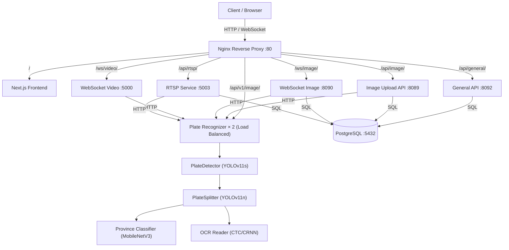

# 🚗 ALPR-V2 — Automatic License Plate Recognition System

> AI-powered License Plate Recognition System with Real-time Processing, WebSocket Support, and Microservices Architecture

[](https://www.docker.com/)
[](https://fastapi.tiangolo.com/)
[](https://nextjs.org/)
[](https://www.python.org/)
[](https://github.com/ultralytics/ultralytics)

---

## 📋 Table of Contents

- [Overview](#-overview)
- [Architecture](#-architecture)
- [Services](#-services)
- [Tech Stack](#-tech-stack)
- [Quick Start](#-quick-start)
- [Environment Variables](#-environment-variables)
- [API Documentation](#-api-documentation)
- [Performance](#-performance)

---

## 🎯 Overview

ALPR-V2 is an Automatic License Plate Recognition system built with AI and Deep Learning, supporting:

- 🖼️ **Real-time image processing** via HTTP upload and WebSocket
- 🎥 **Video frame streaming** via WebSocket
- 📡 **RTSP stream processing** from IP cameras
- 🔌 **RESTful API** for system integration
- 💳 **Subscription & quota management**
- 🔐 **JWT-based authentication**

---

## 🏛️ Architecture



### Processing Pipeline

```
Image Input
    ↓
PlateDetector (YOLOv11s)      ← detects car + plate regions
    ↓
PlateSplitter (YOLOv11n)      ← splits plate into character segments
    ↓
    ├── Province Classifier (MobileNetV3) → province name
    └── CTC OCR Reader (CRNN)            → plate digits / letters
    ↓
Result: { plate_id, province, full_plate, format_flag }
```

---

## 🔧 Services

| # | Service | Container | Internal Port | Public Path |
|---|---------|-----------|--------------|-------------|
| 1 | **Nginx** | `alpr_nginx` | 80 | — |
| 2 | **Next.js Frontend** | `alpr_nextjs` | 3000 | `/` |
| 3 | **General API** | `alpr_general_api` | 8092 | `/api/general/` |
| 4 | **Image Upload API** | `alpr_api_image` | 8089 | `/api/image/` |
| 5 | **WebSocket Video** | `alpr_websocket_video` | 5000 | `/ws/video/` |
| 6 | **RTSP Service** | `alpr_rtsp_service` | 5003 | `/api/rtsp/` |
| 7 | **Plate Recognizer** | *(2 replicas)* | 5000 | `/api/v1/image/` |
| 8 | **PostgreSQL** | `alpr_postgres` | 5432 | — |

### Service Descriptions

**plate_recognizer** — AI core engine running 4 models (YOLOv11s detector, YOLOv11n splitter, MobileNetV3 province classifier, CTC/CRNN OCR). Deployed as 2 load-balanced replicas, each limited to 2 GB RAM.

**alpr_web** — Next.js 14 dashboard for managing tokens, subscriptions, RTSP streams, image/video upload, and viewing detection logs.

**alpr_general_api** — FastAPI gateway handling authentication (JWT), token CRUD, subscription info, payment, and user management.

**alpr_api_image** — FastAPI service for authenticated one-shot image uploads. Validates **API-type** service tokens, deducts quota (`request_quota`), calls the plate recognizer, and persists structured logs to PostgreSQL.

**alpr_websocket_video** — WebSocket endpoint for video frame streaming. Token is embedded in the URL path. Optimised for high-throughput frame delivery (up to 5 MB/frame).

**alpr_rtsp_service** — Manages RTSP camera streams, performs continuous license plate detection, and supports a live Web Viewer. Stores detection events to the database.

---

## 🛠️ Tech Stack

| Layer | Technology |
|-------|-----------|
| Frontend | Next.js 14, TypeScript, Ant Design, Redux Toolkit |
| Backend APIs | FastAPI (Python 3.11+), SQLAlchemy, Pydantic |
| AI Models | PyTorch, YOLOv11 (Ultralytics), MobileNetV3, CTC/CRNN |
| Image Processing | OpenCV, Pillow |
| Database | PostgreSQL 15 |
| Reverse Proxy | Nginx Alpine |
| Containerisation | Docker & Docker Compose |
| Auth | JWT (python-jose / PyJWT) |

---

## 🚀 Quick Start

### Prerequisites

- Docker ≥ 24 and Docker Compose ≥ 2
- 8 GB RAM minimum (16 GB recommended for 2 AI replicas)
- Linux / macOS / Windows (WSL2)

### 1 — Clone

```bash
git clone https://github.com/yourusername/ALPR-V2.git
cd ALPR-V2/alpr_service
```

### 2 — Configure environment variables

Copy and edit `.env` for each service that needs one:

```bash
cp alpr_general_api/.env.example alpr_general_api/.env
# edit DB credentials, JWT_SECRET, etc.
```

Key variables to set before first run:

```env
# PostgreSQL
POSTGRES_USER=postgres
POSTGRES_PASSWORD=postgres
POSTGRES_DB=alpr_db

# General API
JWT_SECRET=<random_secret>

# Plate Recognizer
DEVICE=cpu          # set to 'cuda' for GPU inference
```

### 3 — Start all services

```bash
docker compose up -d
```

### 4 — Check status

```bash
docker compose ps
docker compose logs -f plate-recognizer
```

### 5 — Access

| Interface | URL |
|-----------|-----|
| Dashboard | http://localhost |
| General API docs | http://localhost/api/general/docs |
| Plate Recognizer health | http://localhost/api/v1/image/readyz |
| RTSP Service docs | http://localhost/api/rtsp/docs |

### Development mode

A separate `docker-compose.dev.yml` is available for hot-reload development:

```bash
docker compose -f docker-compose.dev.yml up -d
```

---

## 🔐 Environment Variables

### alpr_general_api

| Variable | Description |
|----------|-------------|
| `DATABASE_URL` | PostgreSQL async connection string |
| `JWT_SECRET` | Secret key for signing JWTs |
| `JWT_ALGORITHM` | Algorithm (default: `HS256`) |
| `ACCESS_TOKEN_EXPIRE_DAYS` | Token lifetime in days (default: `7`) |

### alpr_rtsp_service

| Variable | Description |
|----------|-------------|
| `PLATE_RECOGNIZER_URL` | Plate recognizer endpoint (internal: `http://plate-recognizer:5000/api/v1/image/process`) |
| `DB_HOST / DB_PORT / DB_NAME` | PostgreSQL connection |
| `DATABASE_ENABLED` | `true` / `false` |

### alpr_web (Next.js build args)

| Variable | Description |
|----------|-------------|
| `NEXT_PUBLIC_BASE_API_GATE_WAY_URL` | General API base URL |
| `NEXT_PUBLIC_API_UPLOAD_IMAGE` | Image Upload API base URL |
| `NEXT_PUBLIC_WEBSOCKET_VIDEO_HANLER` | WebSocket video base URL |
| `NEXT_PUBLIC_RTSP_SERVICE_URL` | RTSP HTTP API base URL |
| `NEXT_PUBLIC_RTSP_WEBSOCKET_URL` | RTSP WebSocket base URL |

---

## 📚 API Documentation

Full interactive documentation is available in the dashboard at **Dashboard → Documentation**, or via the auto-generated Swagger UIs:

| Service | Swagger UI |
|---------|-----------|
| General API | `/api/general/docs` |
| RTSP Service | `/api/rtsp/docs` |

### Key endpoints at a glance

```
# Auth
POST   /api/general/auth/register
POST   /api/general/auth/login
GET    /api/general/auth/me

# Plate Recognition (direct, no token required)
POST   /api/v1/image/process
POST   /api/v1/image/process/skip/car
POST   /api/v1/image/process/from-plate-crop
GET    /readyz

# Image Upload (API token required — service_type: API)
POST   /api/image/upload-image

# WebSocket — Video (VIDEO_WEBSOCKET token in path)
WS     ws://host/ws/video/{token}

# RTSP Streams
GET    /api/rtsp/streams
POST   /api/rtsp/streams
POST   /api/rtsp/streams/{id}/start
POST   /api/rtsp/streams/{id}/stop
WS     ws://host/api/rtsp/stream/{id}

# Token Management
GET    /api/general/tokens/{user_id}?service_type=API
POST   /api/general/tokens
PUT    /api/general/tokens
DELETE /api/general/tokens
# service_type values: API | VIDEO_WEBSOCKET | RTSP

# Subscription
GET    /api/general/info/subscribe/{user_id}
```

### Plate recognizer response

```json
{
  "car_bbox": null,
  "plate_bbox": [[x1,y1],[x2,y2],[x3,y3],[x4,y4]],
  "plate_id": "1ฒว8052",
  "province": "ชลบุรี",
  "full_plate": "1ฒว8052 ชลบุรี",
  "format_flag": "complete",
  "message": "OK"
}
```

---

## 📊 Performance

| Metric | Value |
|--------|-------|
| Inference time (single image) | ~200 ms |
| OCR accuracy | ~92% |
| Province classification accuracy | ~95% |
| Concurrent users (load balanced) | 100+ |
| Max upload size (HTTP) | 10 MB |
| Max WebSocket frame (video) | 5 MB |
| Max WebSocket frame (image) | 50 MB |

---

## 🗂️ Project Structure

```
alpr_service/
├── nginx.conf                  # Nginx reverse proxy + routing rules
├── docker-compose.yml          # Production compose
├── docker-compose.dev.yml      # Development compose (hot reload)
├── dump.sql                    # Initial DB schema + seed data
├── plate_recognizer/           # AI inference engine (YOLOv11 + OCR)
├── alpr_web/                   # Next.js 14 frontend dashboard
├── alpr_general_api/           # Auth, tokens, subscriptions, users
├── alpr_api_image/             # Authenticated image upload + logging (service_type: API)
├── alpr_websocket_image/       # WS image service (not exposed in dashboard)
├── alpr_websocket_video/       # WebSocket real-time video processing (service_type: VIDEO_WEBSOCKET)
├── alpr_rtsp_service/          # RTSP camera stream management (service_type: RTSP)
└── videos/                     # Shared video storage (read-only mount)
```

---

<div align="center">
  <strong>Built with FastAPI · Next.js · PyTorch · YOLOv11</strong>
</div>
