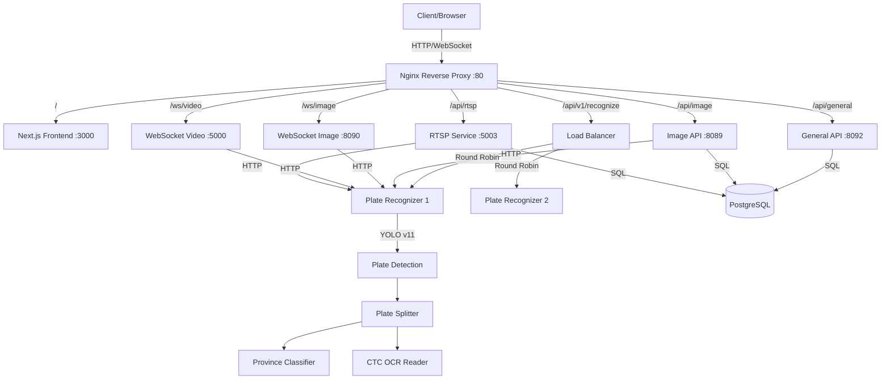

# 🚗 ALPR-V2 - Automatic License Plate Recognition System

> Advanced AI-powered License Plate Recognition System with Real-time Processing, WebSocket Support, and Multi-Service Architecture

[](https://www.docker.com/)
[](https://fastapi.tiangolo.com/)
[](https://nextjs.org/)
[](https://www.python.org/)
[](https://github.com/ultralytics/ultralytics)

---

## 📋 Table of Contents

- [Overview](#-overview)
- [Features](#-features)
- [Architecture](#-architecture)
- [Services](#-services)
- [Tech Stack](#-tech-stack)
- [Performance](#-performance)
- [Installation](#-installation)
- [API Documentation](#-api-documentation)
- [License](#-license)

---

## 🎯 Overview

ALPR-V2 เป็นระบบจดจำป้ายทะเบียนรถอัตโนมัติที่พัฒนาด้วย AI และ Deep Learning โดยรองรับ:

- 🖼️ **การประมวลผลรูปภาพแบบ Real-time**
- 🎥 **การประมวลผลวิดีโอและ RTSP Stream**
- 🔌 **WebSocket สำหรับการสื่อสารแบบ Real-time**
- 🌐 **RESTful API สำหรับการ Integration**
- 💰 **ระบบ Subscription และ Payment Gateway**
- 🔐 **Authentication และ Authorization**

ระบบนี้ออกแบบมาสำหรับการใช้งานจริงในระดับ Production พร้อม Load Balancing และ Reverse Proxy ด้วย Nginx

---

## ✨ Features

### 🎯 Core Features

- ✅ **License Plate Detection** - ตรวจจับป้ายทะเบียนด้วย YOLOv11
- ✅ **OCR Recognition** - อ่านข้อความบนป้ายทะเบียนด้วย CTC/CRNN
- ✅ **Province Classification** - จำแนกจังหวัดด้วย MobileNetV3
- ✅ **Multi-format Support** - รองรับรูปภาพและวิดีโอหลายรูปแบบ
- ✅ **Real-time Processing** - ประมวลผลแบบ Real-time ผ่าน WebSocket
- ✅ **RTSP Streaming** - รองรับ RTSP stream จากกล้อง IP

### 💼 Business Features

- 🔐 **User Authentication** - JWT-based authentication
- 💳 **Payment Integration** - รองรับการชำระเงินออนไลน์
- 📊 **Subscription Management** - จัดการ subscription plans
- 📈 **API Quota Management** - จัดการโควต้าการใช้งาน API
- 📝 **Logging & Analytics** - บันทึกการใช้งานและสถิติ

### 🏗️ Infrastructure Features

- 🔄 **Load Balancing** - Nginx reverse proxy with round-robin
- 🐳 **Docker Compose** - รัน 7 services พร้อมกัน
- 📦 **Microservices Architecture** - แยก services ตามหน้าที่
- 🔌 **Service Discovery** - Docker network routing
- 🛡️ **Security** - Token-based authentication, request validation

---

## 🏛️ Architecture



### 🔄 Processing Pipeline

```
Image Input
    ↓
PlateDetector (YOLOv11s)
    ↓
PlateSplitter (YOLOv11n)
    ↓
    ├── Province Classifier (MobileNetV3) → จังหวัด
    └── CTC OCR Reader (CRNN) → ตัวเลข/อักษร
    ↓
Combined Result: "1ฒว8052 ชลบุรี"
```

---

## 🔧 Services

### 1️⃣ **plate_recognizer** (AI Core Engine)

- **Port**: 5000
- **Replicas**: 2 (Load Balanced)
- **Memory**: 2GB per instance
- **Tech**: FastAPI, PyTorch, YOLOv11
- **Models**:
  - Plate Detector (YOLOv11s)
  - Plate Splitter (YOLOv11n)
  - Province Classifier (MobileNetV3)
  - OCR Reader (CTC/CRNN)

### 2️⃣ **alpr_web** (Frontend)

- **Port**: 3000
- **Tech**: Next.js 14+, TypeScript, TailwindCSS
- **Features**: Dashboard, Analytics, Payment UI

### 3️⃣ **alpr_general_api** (General API Gateway)

- **Port**: 8092
- **Tech**: FastAPI, SQLAlchemy
- **Features**: Authentication, Payment, Subscription, User Management

### 4️⃣ **alpr_api_image** (Image Upload API)

- **Port**: 8089
- **Tech**: FastAPI, httpx
- **Features**: Image upload, File validation, Quota management

### 5️⃣ **alpr_websocket_image** (WebSocket Image)

- **Port**: 8090
- **Tech**: FastAPI WebSocket
- **Features**: Real-time image processing via WebSocket

### 6️⃣ **alpr_websocket_video** (WebSocket Video)

- **Port**: 5000
- **Tech**: FastAPI WebSocket, OpenCV
- **Features**: Real-time video processing, Frame extraction

### 7️⃣ **alpr_rtsp_service** (RTSP Streaming)

- **Port**: 5003
- **Tech**: FastAPI, OpenCV, YOLOv8
- **Features**: RTSP stream processing, Car detection, Recording

### 🔄 **nginx** (Reverse Proxy)

- **Port**: 80
- **Tech**: Nginx Alpine
- **Features**: Load balancing, SSL termination, Request routing

### 🗄️ **postgres** (Database)

- **Port**: 5432
- **Tech**: PostgreSQL 15
- **Features**: User data, Subscriptions, Logs, Analytics

---

## 🛠️ Tech Stack

### Backend

- **FastAPI** - High-performance async API framework
- **PyTorch** - Deep learning framework
- **YOLOv11** - Object detection (Ultralytics)
- **OpenCV** - Image/video processing
- **SQLAlchemy** - ORM for PostgreSQL
- **Pydantic** - Data validation

### Frontend

- **Next.js 14+** - React framework with SSR
- **TypeScript** - Type-safe JavaScript
- **TailwindCSS** - Utility-first CSS framework

### AI/ML Models

- **YOLOv11s** - Plate detection
- **YOLOv11n** - Plate character splitting
- **MobileNetV3** - Province classification
- **CTC/CRNN** - OCR text recognition

### DevOps

- **Docker & Docker Compose** - Containerization
- **Nginx** - Reverse proxy & load balancer
- **PostgreSQL** - Relational database

---

## 📊 Performance

| Metric                | Before | After  | Improvement       |
| --------------------- | ------ | ------ | ----------------- |
| **Inference Time**    | ~800ms | ~200ms | **4x faster** ⚡  |
| **OCR Accuracy**      | ~85%   | ~92%   | **+7%** 📈        |
| **Province Accuracy** | ~75%   | ~95%   | **+20%** 🎯       |
| **Model Loading**     | ~5s    | ~2s    | **2.5x faster**   |
| **Concurrent Users**  | N/A    | 100+   | **Load Balanced** |

---

## 🚀 Installation

### Prerequisites

- Docker & Docker Compose
- 8GB+ RAM (recommended 16GB)
- Linux/Windows/macOS

### Quick Start

1. **Clone the repository**

```bash
git clone https://github.com/yourusername/ALPR-V2.git
cd ALPR-V2/alpr_service
```

2. **Configure environment variables**

```bash
# Copy .env.example to .env for each service
cp alpr_general_api/.env.example alpr_general_api/.env
cp alpr_api_image/.env.example alpr_api_image/.env
# ... (configure other services)
```

3. **Start all services**

```bash
docker-compose up -d
```

4. **Check service status**

```bash
docker-compose ps
```

5. **Access the application**

- Frontend: http://localhost
- API Docs: http://localhost/api/general/docs
- Plate Recognition: http://localhost/api/v1/recognize

### Configuration

#### Database (PostgreSQL)

```env
POSTGRES_USER=postgres
POSTGRES_PASSWORD=your_secure_password
POSTGRES_DB=alpr_db
```

#### Plate Recognizer

```env
MODEL_PATH=./data/models/
DEVICE=cpu  # or cuda for GPU
```

#### API Gateway

```env
JWT_SECRET=your_jwt_secret_key
STRIPE_API_KEY=your_stripe_key
```

---

## 📚 API Documentation

### Plate Recognition API

#### Process Image

```http
POST /api/v1/recognize
Content-Type: multipart/form-data

file: <image_file>
```

**Response:**

```json
{
  "car_bbox": null,
  "plate_bbox": [[x1, y1], [x2, y2], [x3, y3], [x4, y4]],
  "plate_id": "1ฒว8052",
  "province": "ชลบุรี",
  "full_plate": "1ฒว8052 ชลบุรี",
  "format_flag": "complete",
  "message": "OK"
}
```

#### Health Check

```http
GET /readyz
```

### General API

#### Authentication

```http
POST /api/general/auth/login
Content-Type: application/json

{
  "email": "user@example.com",
  "password": "password123"
}
```

#### Get User Info

```http
GET /api/general/user/me
Authorization: Bearer {token}
```

### WebSocket API

#### Image WebSocket

```javascript
const ws = new WebSocket("ws://localhost/ws/image");
ws.send(imageData);
ws.onmessage = (event) => {
  const result = JSON.parse(event.data);
  console.log(result);
};
```

---

## 👥 Team

Developed by ALPRV2 Development Team

---

<div align="center">
  <strong>Built using FastAPI, Next.js, and PyTorch</strong>
</div>
