# ALPR-V2 — System Diagrams & Test Cases

> Auto-generated system analysis for the ALPR-V2 Automatic License Plate Recognition System

---

## Table of Contents

1. [Use Case Diagram](#1-use-case-diagram)
2. [Sequence Diagrams](#2-sequence-diagrams)
   - [2.1 User Registration & Login](#21-user-registration--login)
   - [2.2 User Authentication](#22-user-authentication)
   - [2.3 Token Management](#23-token-management)
     - [2.3.1 Create Token](#231-create-token)
     - [2.3.2 Edit Token](#232-edit-token)
     - [2.3.3 Delete Token](#233-delete-token)
   - [2.4 Image Recognition](#24-image-recognition)
     - [2.4.1 Upload Image — Dashboard](#241-upload-image--dashboard)
     - [2.4.2 Send Image via API](#242-send-image-via-api)
   - [2.5 Video Streaming](#25-video-streaming)
     - [2.5.1 Upload Video — Dashboard](#251-upload-video--dashboard)
     - [2.5.2 Send Video via WebSocket](#252-send-video-via-websocket)
   - [2.6 RTSP Camera Management](#26-rtsp-camera-management)
     - [2.6.1 Register Camera](#261-register-camera)
     - [2.6.2 Process Video Stream via RTSP](#262-process-video-stream-via-rtsp)
     - [2.6.3 Edit Camera Information](#263-edit-camera-information)
     - [2.6.4 Remove Camera](#264-remove-camera)
     - [2.6.5 View Stream Status](#265-view-stream-status)
   - [2.7 Subscription Management](#27-subscription-management)
     - [2.7.1 Subscribe Plan](#271-subscribe-plan)
     - [2.7.2 Change Subscription Plan](#272-change-subscription-plan)
     - [2.7.3 Cancel Subscription](#273-cancel-subscription)
3. [Test Cases — System Testing](#3-test-cases--system-testing)
   - [TC-AUTH — Authentication](#tc-auth--authentication)
   - [TC-TOKEN — Token Management](#tc-token--token-management)
   - [TC-IMAGE — Image Upload & Recognition](#tc-image--image-upload--recognition)
   - [TC-VIDEO — WebSocket Video Streaming](#tc-video--websocket-video-streaming)
   - [TC-RTSP — RTSP Stream Management](#tc-rtsp--rtsp-stream-management)
   - [TC-SUB — Subscription Management](#tc-sub--subscription-management)
   - [TC-AI — AI Plate Recognizer](#tc-ai--ai-plate-recognizer)

---

## 1. Use Case Diagram

```mermaid
---
title: ALPR-V2 Use Case Diagram
---
flowchart TD
    %% Actors
    Guest(["👤 Guest\n(Unauthenticated)"])
    User(["👤 Registered User"])
    Admin(["👤 Admin"])
    ExtSystem(["🖥️ External System\n(API Client)"])
    Camera(["📷 IP Camera\n(RTSP Source)"])

    %% ── Auth Subsystem ──
    subgraph AUTH ["🔐 Authentication"]
        UC1([Register Account])
        UC2([Login & Get JWT])
        UC3([View My Profile])
    end

    %% ── Subscription Subsystem ──
    subgraph SUB ["💳 Subscription & Quota"]
        UC4([Browse Subscription Plans])
        UC5([Purchase Subscription])
        UC6([View Current Subscription])
        UC7([Check Quota Usage])
    end

    %% ── Token Subsystem ──
    subgraph TOK ["🔑 Token Management"]
        UC8([Create API Token])
        UC9([Create Video-WS Token])
        UC10([Create RTSP Token])
        UC11([List Tokens])
        UC12([Update Token])
        UC13([Delete Token])
        UC14([View Token Usage per Hour])
    end

    %% ── Image Recognition Subsystem ──
    subgraph IMG ["🖼️ Image Recognition"]
        UC15([Upload Image via HTTP])
        UC16([Recognize Plate – Direct API])
        UC17([Recognize Plate – Skip Car Detection])
        UC18([Recognize Plate – From Plate Crop])
        UC19([View Image Logs])
    end

    %% ── WebSocket Video Subsystem ──
    subgraph WSV ["🎥 WebSocket Video Streaming"]
        UC20([Connect via WS with Token])
        UC21([Stream Video Frames])
        UC22([Receive Recognition Results])
    end

    %% ── RTSP Subsystem ──
    subgraph RTSP ["📡 RTSP Camera Streams"]
        UC23([Add RTSP Stream])
        UC24([Start / Stop Stream])
        UC25([View Live Stream – Web Viewer])
        UC26([View Detection Events])
    end

    %% ── AI Engine (internal) ──
    subgraph AI ["🤖 AI Plate Recognizer – Internal Only"]
        UC27([Detect Car & Plate – YOLOv11s])
        UC28([Split Plate Characters – YOLOv11n])
        UC29([Classify Province – MobileNetV3])
        UC30([Read Characters – CTC/CRNN OCR])
    end

    %% Actor → Use Case relationships
    Guest --> UC1
    Guest --> UC2

    User --> UC3
    User --> UC4
    User --> UC5
    User --> UC6
    User --> UC7
    User --> UC8
    User --> UC9
    User --> UC10
    User --> UC11
    User --> UC12
    User --> UC13
    User --> UC14
    User --> UC15
    User --> UC19
    User --> UC23
    User --> UC24
    User --> UC25
    User --> UC26

    ExtSystem --> UC16
    ExtSystem --> UC17
    ExtSystem --> UC18
    ExtSystem --> UC20
    ExtSystem --> UC21
    ExtSystem --> UC22

    Camera --> UC24

    Admin --> UC4
    Admin --> UC5

    %% Include / Extend
    UC15 -.->|«include»| UC16
    UC21 -.->|«include»| UC22
    UC24 -.->|«include»| UC26
    UC16 -.->|«include»| UC27
    UC27 -.->|«include»| UC28
    UC28 -.->|«include»| UC29
    UC28 -.->|«include»| UC30
```

---

## 2. Sequence Diagrams

### 2.1 User Registration & Login

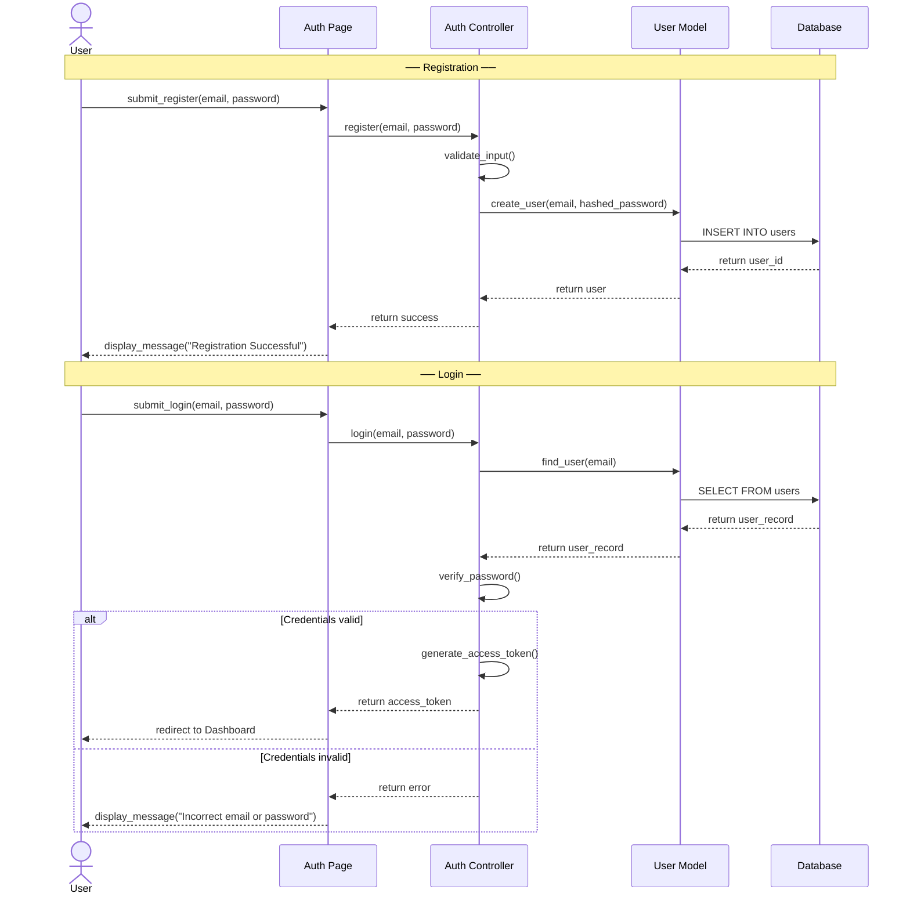
```mermaid
sequenceDiagram
    actor User
    participant AuthPage as Auth Page
    participant AuthController as Auth Controller
    participant UserModel as User Model
    participant DB as Database

    Note over User,DB: ── Registration ──
    User->>AuthPage: submit_register(email, password)
    AuthPage->>AuthController: register(email, password)
    AuthController->>AuthController: validate_input()
    AuthController->>UserModel: create_user(email, hashed_password)
    UserModel->>DB: INSERT INTO users
    DB-->>UserModel: return user_id
    UserModel-->>AuthController: return user
    AuthController-->>AuthPage: return success
    AuthPage-->>User: display_message("Registration Successful")

    Note over User,DB: ── Login ──
    User->>AuthPage: submit_login(email, password)
    AuthPage->>AuthController: login(email, password)
    AuthController->>UserModel: find_user(email)
    UserModel->>DB: SELECT FROM users
    DB-->>UserModel: return user_record
    UserModel-->>AuthController: return user_record
    AuthController->>AuthController: verify_password()
    alt Credentials valid
        AuthController->>AuthController: generate_access_token()
        AuthController-->>AuthPage: return access_token
        AuthPage-->>User: redirect to Dashboard
    else Credentials invalid
        AuthController-->>AuthPage: return error
        AuthPage-->>User: display_message("Incorrect email or password")
    end
```

---

### 2.2 User Authentication

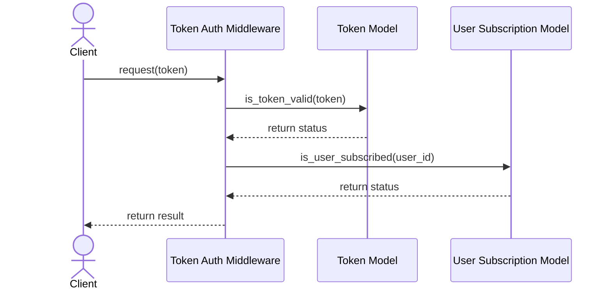
```mermaid
sequenceDiagram
    actor Client
    participant TAM as Token Auth Middleware
    participant TokenModel as Token Model
    participant SubModel as User Subscription Model

    Client->>TAM: request(token)
    TAM->>TokenModel: is_token_valid(token)
    TokenModel-->>TAM: return status
    TAM->>SubModel: is_user_subscribed(user_id)
    SubModel-->>TAM: return status
    TAM-->>Client: return result
```

---

### 2.3 Token Management

#### 2.3.1 Create Token

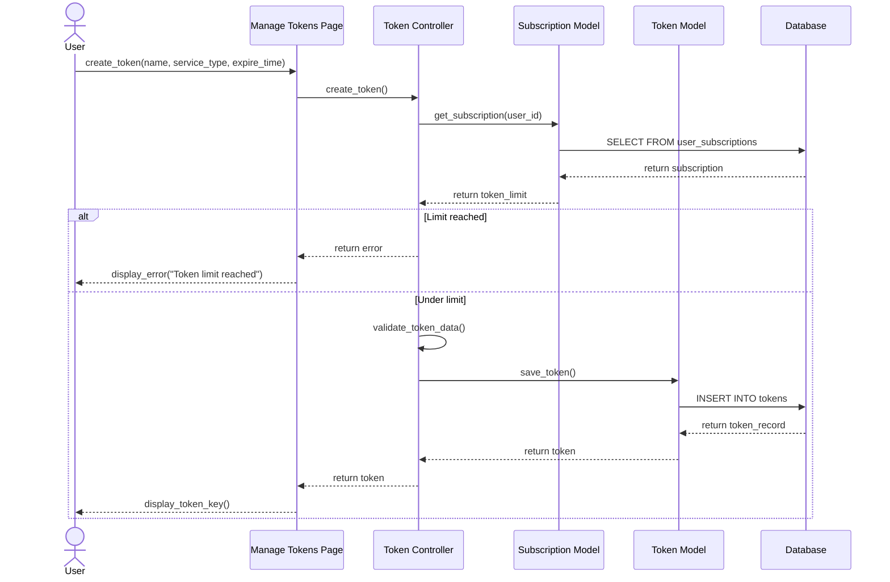
```mermaid
sequenceDiagram
    actor User
    participant TokenPage as Manage Tokens Page
    participant TokenController as Token Controller
    participant SubModel as Subscription Model
    participant TokenModel as Token Model
    participant DB as Database

    User->>TokenPage: create_token(name, service_type, expire_time)
    TokenPage->>TokenController: create_token()
    TokenController->>SubModel: get_subscription(user_id)
    SubModel->>DB: SELECT FROM user_subscriptions
    DB-->>SubModel: return subscription
    SubModel-->>TokenController: return token_limit
    alt Limit reached
        TokenController-->>TokenPage: return error
        TokenPage-->>User: display_error("Token limit reached")
    else Under limit
        TokenController->>TokenController: validate_token_data()
        TokenController->>TokenModel: save_token()
        TokenModel->>DB: INSERT INTO tokens
        DB-->>TokenModel: return token_record
        TokenModel-->>TokenController: return token
        TokenController-->>TokenPage: return token
        TokenPage-->>User: display_token_key()
    end
```

---

#### 2.3.2 Edit Token

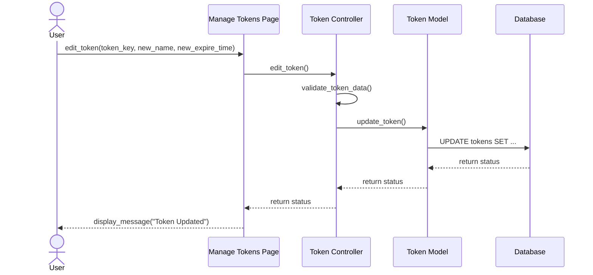
```mermaid
sequenceDiagram
    actor User
    participant TokenPage as Manage Tokens Page
    participant TokenController as Token Controller
    participant TokenModel as Token Model
    participant DB as Database

    User->>TokenPage: edit_token(token_key, new_name, new_expire_time)
    TokenPage->>TokenController: edit_token()
    TokenController->>TokenController: validate_token_data()
    TokenController->>TokenModel: update_token()
    TokenModel->>DB: UPDATE tokens SET ...
    DB-->>TokenModel: return status
    TokenModel-->>TokenController: return status
    TokenController-->>TokenPage: return status
    TokenPage-->>User: display_message("Token Updated")
```

---

#### 2.3.3 Delete Token

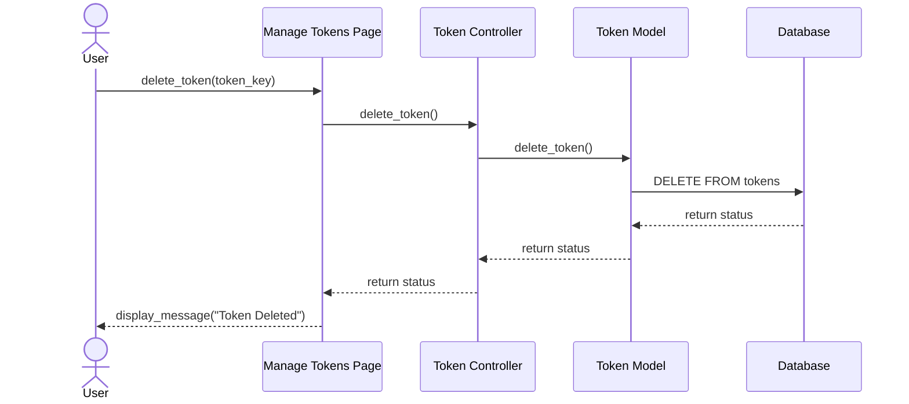
```mermaid
sequenceDiagram
    actor User
    participant TokenPage as Manage Tokens Page
    participant TokenController as Token Controller
    participant TokenModel as Token Model
    participant DB as Database

    User->>TokenPage: delete_token(token_key)
    TokenPage->>TokenController: delete_token()
    TokenController->>TokenModel: delete_token()
    TokenModel->>DB: DELETE FROM tokens
    DB-->>TokenModel: return status
    TokenModel-->>TokenController: return status
    TokenController-->>TokenPage: return status
    TokenPage-->>User: display_message("Token Deleted")
```

---

### 2.4 Image Recognition

#### 2.4.1 Upload Image — Dashboard

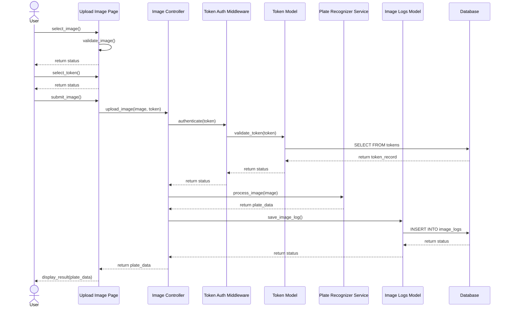
```mermaid
sequenceDiagram
    actor User
    participant UploadPage as Upload Image Page
    participant ImageController as Image Controller
    participant TAM as Token Auth Middleware
    participant TokenModel as Token Model
    participant PR as Plate Recognizer Service
    participant ImageLogsModel as Image Logs Model
    participant DB as Database

    User->>UploadPage: select_image()
    UploadPage->>UploadPage: validate_image()
    UploadPage-->>User: return status
    User->>UploadPage: select_token()
    UploadPage-->>User: return status
    User->>UploadPage: submit_image()
    UploadPage->>ImageController: upload_image(image, token)
    ImageController->>TAM: authenticate(token)
    TAM->>TokenModel: validate_token(token)
    TokenModel->>DB: SELECT FROM tokens
    DB-->>TokenModel: return token_record
    TokenModel-->>TAM: return status
    TAM-->>ImageController: return status
    ImageController->>PR: process_image(image)
    PR-->>ImageController: return plate_data
    ImageController->>ImageLogsModel: save_image_log()
    ImageLogsModel->>DB: INSERT INTO image_logs
    DB-->>ImageLogsModel: return status
    ImageLogsModel-->>ImageController: return status
    ImageController-->>UploadPage: return plate_data
    UploadPage-->>User: display_result(plate_data)
```

---

#### 2.4.2 Send Image via API

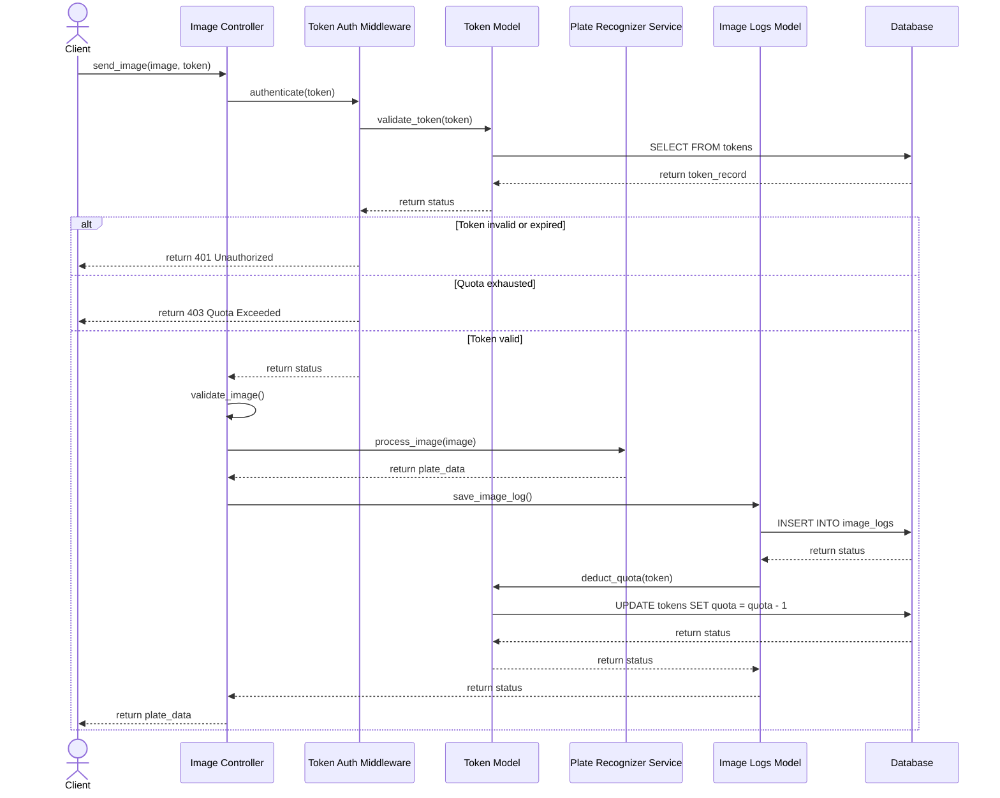
```mermaid
sequenceDiagram
    actor Client
    participant ImageController as Image Controller
    participant TAM as Token Auth Middleware
    participant TokenModel as Token Model
    participant PR as Plate Recognizer Service
    participant ImageLogsModel as Image Logs Model
    participant DB as Database

    Client->>ImageController: send_image(image, token)
    ImageController->>TAM: authenticate(token)
    TAM->>TokenModel: validate_token(token)
    TokenModel->>DB: SELECT FROM tokens
    DB-->>TokenModel: return token_record
    TokenModel-->>TAM: return status

    alt Token invalid or expired
        TAM-->>Client: return 401 Unauthorized
    else Quota exhausted
        TAM-->>Client: return 403 Quota Exceeded
    else Token valid
        TAM-->>ImageController: return status
        ImageController->>ImageController: validate_image()
        ImageController->>PR: process_image(image)
        PR-->>ImageController: return plate_data
        ImageController->>ImageLogsModel: save_image_log()
        ImageLogsModel->>DB: INSERT INTO image_logs
        DB-->>ImageLogsModel: return status
        ImageLogsModel->>TokenModel: deduct_quota(token)
        TokenModel->>DB: UPDATE tokens SET quota = quota - 1
        DB-->>TokenModel: return status
        TokenModel-->>ImageLogsModel: return status
        ImageLogsModel-->>ImageController: return status
        ImageController-->>Client: return plate_data
    end
```

---

### 2.5 Video Streaming

#### 2.5.1 Upload Video — Dashboard

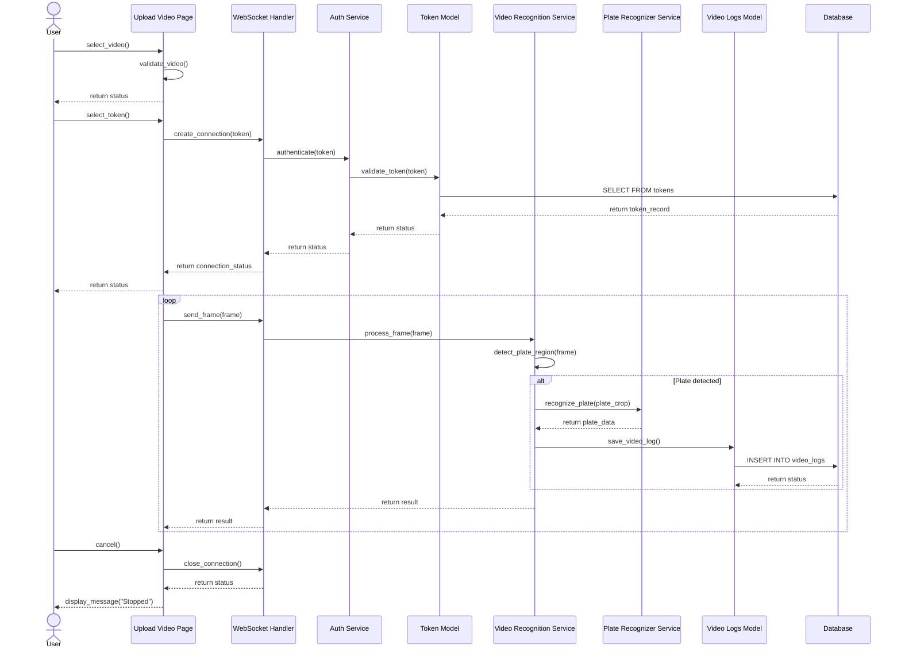
```mermaid
sequenceDiagram
    actor User
    participant UploadPage as Upload Video Page
    participant WSHandler as WebSocket Handler
    participant AuthService as Auth Service
    participant TokenModel as Token Model
    participant VideoService as Video Recognition Service
    participant PR as Plate Recognizer Service
    participant VideoLogsModel as Video Logs Model
    participant DB as Database

    User->>UploadPage: select_video()
    UploadPage->>UploadPage: validate_video()
    UploadPage-->>User: return status
    User->>UploadPage: select_token()
    UploadPage->>WSHandler: create_connection(token)
    WSHandler->>AuthService: authenticate(token)
    AuthService->>TokenModel: validate_token(token)
    TokenModel->>DB: SELECT FROM tokens
    DB-->>TokenModel: return token_record
    TokenModel-->>AuthService: return status
    AuthService-->>WSHandler: return status
    WSHandler-->>UploadPage: return connection_status
    UploadPage-->>User: return status

    loop
        UploadPage->>WSHandler: send_frame(frame)
        WSHandler->>VideoService: process_frame(frame)
        VideoService->>VideoService: detect_plate_region(frame)
        alt Plate detected
            VideoService->>PR: recognize_plate(plate_crop)
            PR-->>VideoService: return plate_data
            VideoService->>VideoLogsModel: save_video_log()
            VideoLogsModel->>DB: INSERT INTO video_logs
            DB-->>VideoLogsModel: return status
        end
        VideoService-->>WSHandler: return result
        WSHandler-->>UploadPage: return result
    end

    User->>UploadPage: cancel()
    UploadPage->>WSHandler: close_connection()
    WSHandler-->>UploadPage: return status
    UploadPage-->>User: display_message("Stopped")
```

---

#### 2.5.2 Send Video via WebSocket

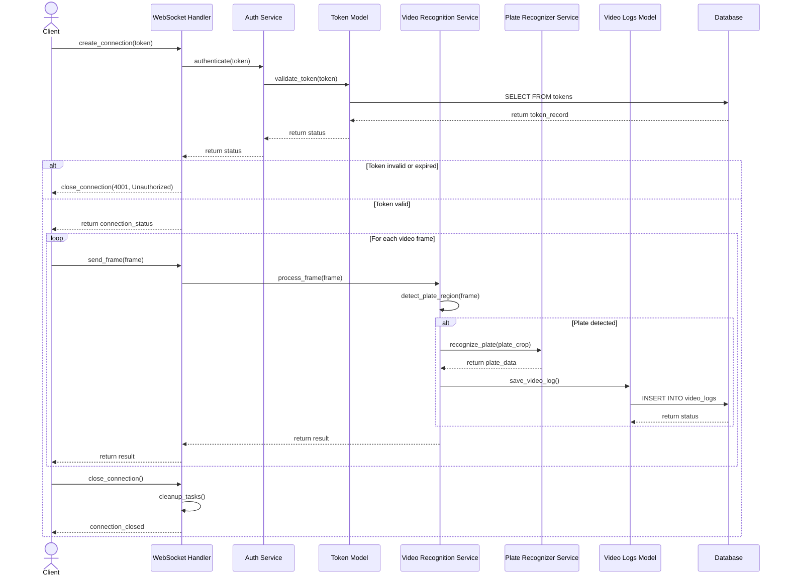
```mermaid
sequenceDiagram
    actor Client
    participant WSHandler as WebSocket Handler
    participant AuthService as Auth Service
    participant TokenModel as Token Model
    participant VideoService as Video Recognition Service
    participant PR as Plate Recognizer Service
    participant VideoLogsModel as Video Logs Model
    participant DB as Database

    Client->>WSHandler: create_connection(token)
    WSHandler->>AuthService: authenticate(token)
    AuthService->>TokenModel: validate_token(token)
    TokenModel->>DB: SELECT FROM tokens
    DB-->>TokenModel: return token_record
    TokenModel-->>AuthService: return status
    AuthService-->>WSHandler: return status

    alt Token invalid or expired
        WSHandler-->>Client: close_connection(4001, Unauthorized)
    else Token valid
        WSHandler-->>Client: return connection_status

        loop For each video frame
            Client->>WSHandler: send_frame(frame)
            WSHandler->>VideoService: process_frame(frame)
            VideoService->>VideoService: detect_plate_region(frame)
            alt Plate detected
                VideoService->>PR: recognize_plate(plate_crop)
                PR-->>VideoService: return plate_data
                VideoService->>VideoLogsModel: save_video_log()
                VideoLogsModel->>DB: INSERT INTO video_logs
                DB-->>VideoLogsModel: return status
            end
            VideoService-->>WSHandler: return result
            WSHandler-->>Client: return result
        end

        Client->>WSHandler: close_connection()
        WSHandler->>WSHandler: cleanup_tasks()
        WSHandler-->>Client: connection_closed
    end
```

---

### 2.6 RTSP Camera Management

#### 2.6.1 Register Camera

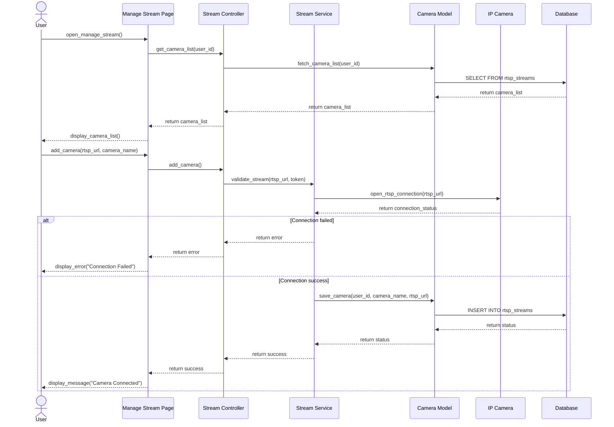
```mermaid
sequenceDiagram
    actor User
    participant StreamPage as Manage Stream Page
    participant StreamController as Stream Controller
    participant StreamService as Stream Service
    participant CameraModel as Camera Model
    participant CAM as IP Camera
    participant DB as Database

    User->>StreamPage: open_manage_stream()
    StreamPage->>StreamController: get_camera_list(user_id)
    StreamController->>CameraModel: fetch_camera_list(user_id)
    CameraModel->>DB: SELECT FROM rtsp_streams
    DB-->>CameraModel: return camera_list
    CameraModel-->>StreamController: return camera_list
    StreamController-->>StreamPage: return camera_list
    StreamPage-->>User: display_camera_list()

    User->>StreamPage: add_camera(rtsp_url, camera_name)
    StreamPage->>StreamController: add_camera()
    StreamController->>StreamService: validate_stream(rtsp_url, token)
    StreamService->>CAM: open_rtsp_connection(rtsp_url)
    CAM-->>StreamService: return connection_status

    alt Connection failed
        StreamService-->>StreamController: return error
        StreamController-->>StreamPage: return error
        StreamPage-->>User: display_error("Connection Failed")
    else Connection success
        StreamService->>CameraModel: save_camera(user_id, camera_name, rtsp_url)
        CameraModel->>DB: INSERT INTO rtsp_streams
        DB-->>CameraModel: return status
        CameraModel-->>StreamService: return status
        StreamService-->>StreamController: return success
        StreamController-->>StreamPage: return success
        StreamPage-->>User: display_message("Camera Connected")
    end
```

---

#### 2.6.2 Process Video Stream via RTSP

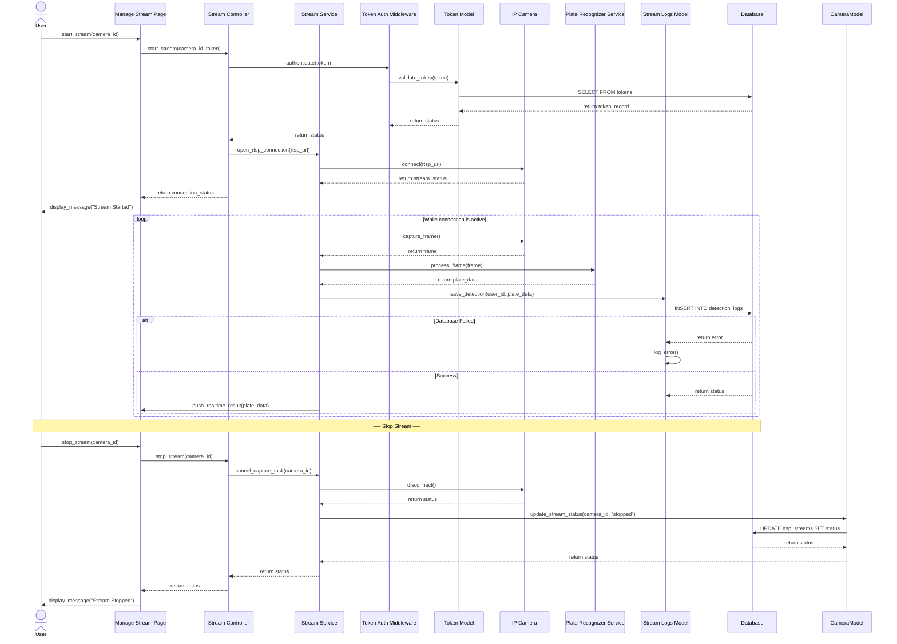
```mermaid
sequenceDiagram
    actor User
    participant StreamPage as Manage Stream Page
    participant StreamController as Stream Controller
    participant StreamService as Stream Service
    participant TAM as Token Auth Middleware
    participant TokenModel as Token Model
    participant CAM as IP Camera
    participant PR as Plate Recognizer Service
    participant StreamLogsModel as Stream Logs Model
    participant DB as Database

    User->>StreamPage: start_stream(camera_id)
    StreamPage->>StreamController: start_stream(camera_id, token)
    StreamController->>TAM: authenticate(token)
    TAM->>TokenModel: validate_token(token)
    TokenModel->>DB: SELECT FROM tokens
    DB-->>TokenModel: return token_record
    TokenModel-->>TAM: return status
    TAM-->>StreamController: return status
    StreamController->>StreamService: open_rtsp_connection(rtsp_url)
    StreamService->>CAM: connect(rtsp_url)
    CAM-->>StreamService: return stream_status
    StreamController-->>StreamPage: return connection_status
    StreamPage-->>User: display_message("Stream Started")

    loop While connection is active
        StreamService->>CAM: capture_frame()
        CAM-->>StreamService: return frame
        StreamService->>PR: process_frame(frame)
        PR-->>StreamService: return plate_data
        StreamService->>StreamLogsModel: save_detection(user_id, plate_data)
        StreamLogsModel->>DB: INSERT INTO detection_logs
        alt Database Failed
            DB-->>StreamLogsModel: return error
            StreamLogsModel->>StreamLogsModel: log_error()
        else Success
            DB-->>StreamLogsModel: return status
            StreamService->>StreamPage: push_realtime_result(plate_data)
        end
    end

    Note over User,DB: ── Stop Stream ──
    User->>StreamPage: stop_stream(camera_id)
    StreamPage->>StreamController: stop_stream(camera_id)
    StreamController->>StreamService: cancel_capture_task(camera_id)
    StreamService->>CAM: disconnect()
    CAM-->>StreamService: return status
    StreamService->>CameraModel: update_stream_status(camera_id, "stopped")
    CameraModel->>DB: UPDATE rtsp_streams SET status
    DB-->>CameraModel: return status
    CameraModel-->>StreamService: return status
    StreamService-->>StreamController: return status
    StreamController-->>StreamPage: return status
    StreamPage-->>User: display_message("Stream Stopped")
```

---

#### 2.6.3 Edit Camera Information

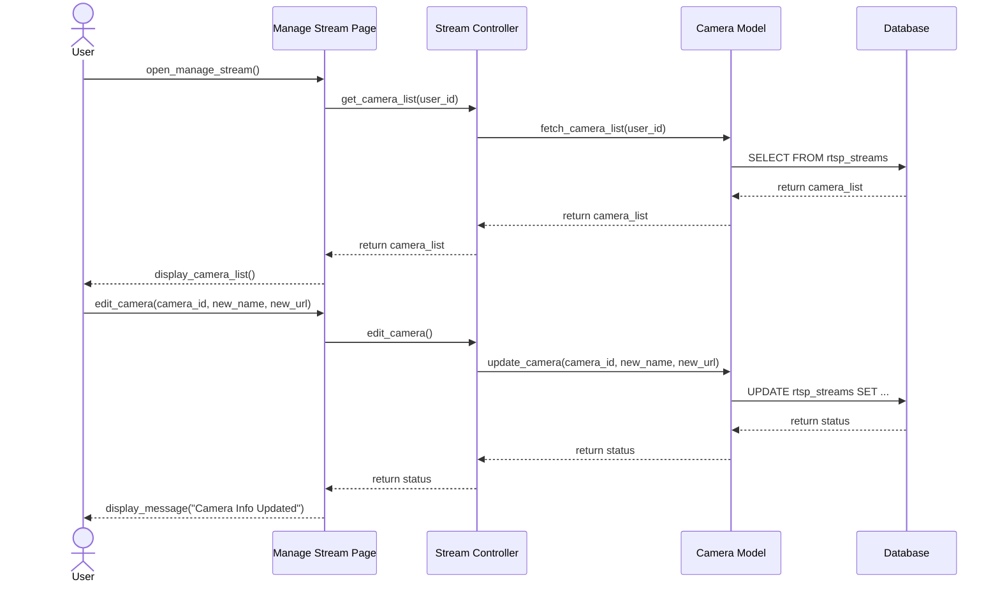
```mermaid
sequenceDiagram
    actor User
    participant StreamPage as Manage Stream Page
    participant StreamController as Stream Controller
    participant CameraModel as Camera Model
    participant DB as Database

    User->>StreamPage: open_manage_stream()
    StreamPage->>StreamController: get_camera_list(user_id)
    StreamController->>CameraModel: fetch_camera_list(user_id)
    CameraModel->>DB: SELECT FROM rtsp_streams
    DB-->>CameraModel: return camera_list
    CameraModel-->>StreamController: return camera_list
    StreamController-->>StreamPage: return camera_list
    StreamPage-->>User: display_camera_list()

    User->>StreamPage: edit_camera(camera_id, new_name, new_url)
    StreamPage->>StreamController: edit_camera()
    StreamController->>CameraModel: update_camera(camera_id, new_name, new_url)
    CameraModel->>DB: UPDATE rtsp_streams SET ...
    DB-->>CameraModel: return status
    CameraModel-->>StreamController: return status
    StreamController-->>StreamPage: return status
    StreamPage-->>User: display_message("Camera Info Updated")
```

---

#### 2.6.4 Remove Camera

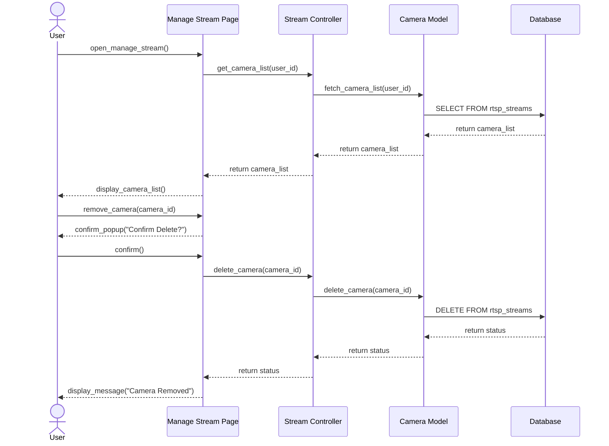
```mermaid
sequenceDiagram
    actor User
    participant StreamPage as Manage Stream Page
    participant StreamController as Stream Controller
    participant CameraModel as Camera Model
    participant DB as Database

    User->>StreamPage: open_manage_stream()
    StreamPage->>StreamController: get_camera_list(user_id)
    StreamController->>CameraModel: fetch_camera_list(user_id)
    CameraModel->>DB: SELECT FROM rtsp_streams
    DB-->>CameraModel: return camera_list
    CameraModel-->>StreamController: return camera_list
    StreamController-->>StreamPage: return camera_list
    StreamPage-->>User: display_camera_list()

    User->>StreamPage: remove_camera(camera_id)
    StreamPage-->>User: confirm_popup("Confirm Delete?")
    User->>StreamPage: confirm()
    StreamPage->>StreamController: delete_camera(camera_id)
    StreamController->>CameraModel: delete_camera(camera_id)
    CameraModel->>DB: DELETE FROM rtsp_streams
    DB-->>CameraModel: return status
    CameraModel-->>StreamController: return status
    StreamController-->>StreamPage: return status
    StreamPage-->>User: display_message("Camera Removed")
```

---

#### 2.6.5 View Stream Status

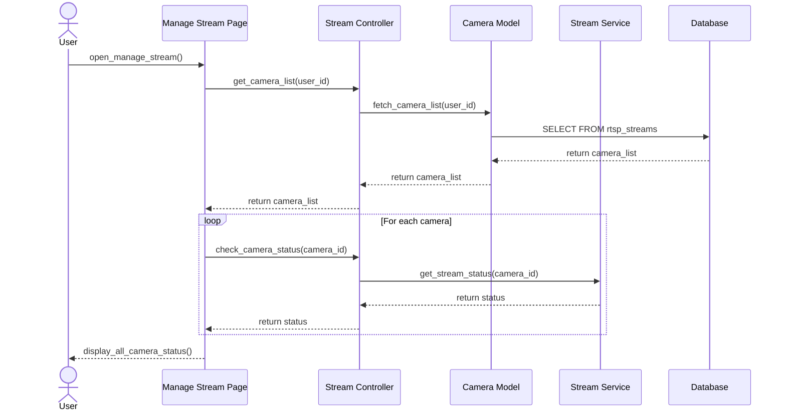
```mermaid
sequenceDiagram
    actor User
    participant StreamPage as Manage Stream Page
    participant StreamController as Stream Controller
    participant CameraModel as Camera Model
    participant StreamService as Stream Service
    participant DB as Database

    User->>StreamPage: open_manage_stream()
    StreamPage->>StreamController: get_camera_list(user_id)
    StreamController->>CameraModel: fetch_camera_list(user_id)
    CameraModel->>DB: SELECT FROM rtsp_streams
    DB-->>CameraModel: return camera_list
    CameraModel-->>StreamController: return camera_list
    StreamController-->>StreamPage: return camera_list

    loop For each camera
        StreamPage->>StreamController: check_camera_status(camera_id)
        StreamController->>StreamService: get_stream_status(camera_id)
        StreamService-->>StreamController: return status
        StreamController-->>StreamPage: return status
    end

    StreamPage-->>User: display_all_camera_status()
```

---

### 2.7 Subscription Management

#### 2.7.1 Subscribe Plan

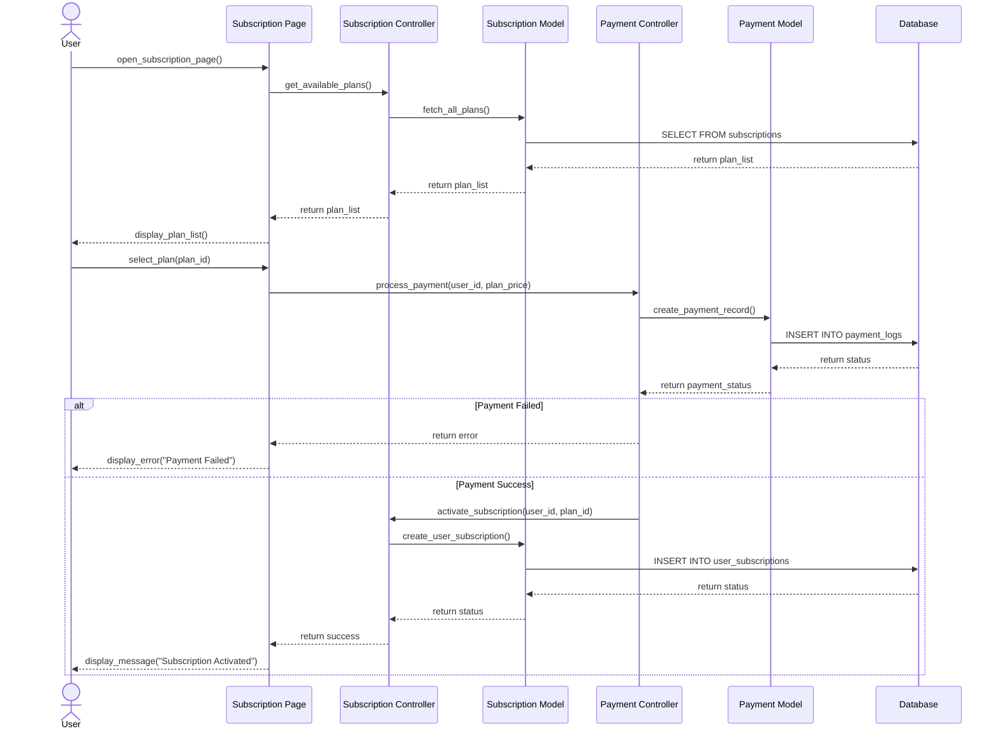
```mermaid
sequenceDiagram
    actor User
    participant SubPage as Subscription Page
    participant SubController as Subscription Controller
    participant SubModel as Subscription Model
    participant PaymentController as Payment Controller
    participant PaymentModel as Payment Model
    participant DB as Database

    User->>SubPage: open_subscription_page()
    SubPage->>SubController: get_available_plans()
    SubController->>SubModel: fetch_all_plans()
    SubModel->>DB: SELECT FROM subscriptions
    DB-->>SubModel: return plan_list
    SubModel-->>SubController: return plan_list
    SubController-->>SubPage: return plan_list
    SubPage-->>User: display_plan_list()

    User->>SubPage: select_plan(plan_id)
    SubPage->>PaymentController: process_payment(user_id, plan_price)
    PaymentController->>PaymentModel: create_payment_record()
    PaymentModel->>DB: INSERT INTO payment_logs
    DB-->>PaymentModel: return status
    PaymentModel-->>PaymentController: return payment_status

    alt Payment Failed
        PaymentController-->>SubPage: return error
        SubPage-->>User: display_error("Payment Failed")
    else Payment Success
        PaymentController->>SubController: activate_subscription(user_id, plan_id)
        SubController->>SubModel: create_user_subscription()
        SubModel->>DB: INSERT INTO user_subscriptions
        DB-->>SubModel: return status
        SubModel-->>SubController: return status
        SubController-->>SubPage: return success
        SubPage-->>User: display_message("Subscription Activated")
    end
```

---

#### 2.7.2 Change Subscription Plan

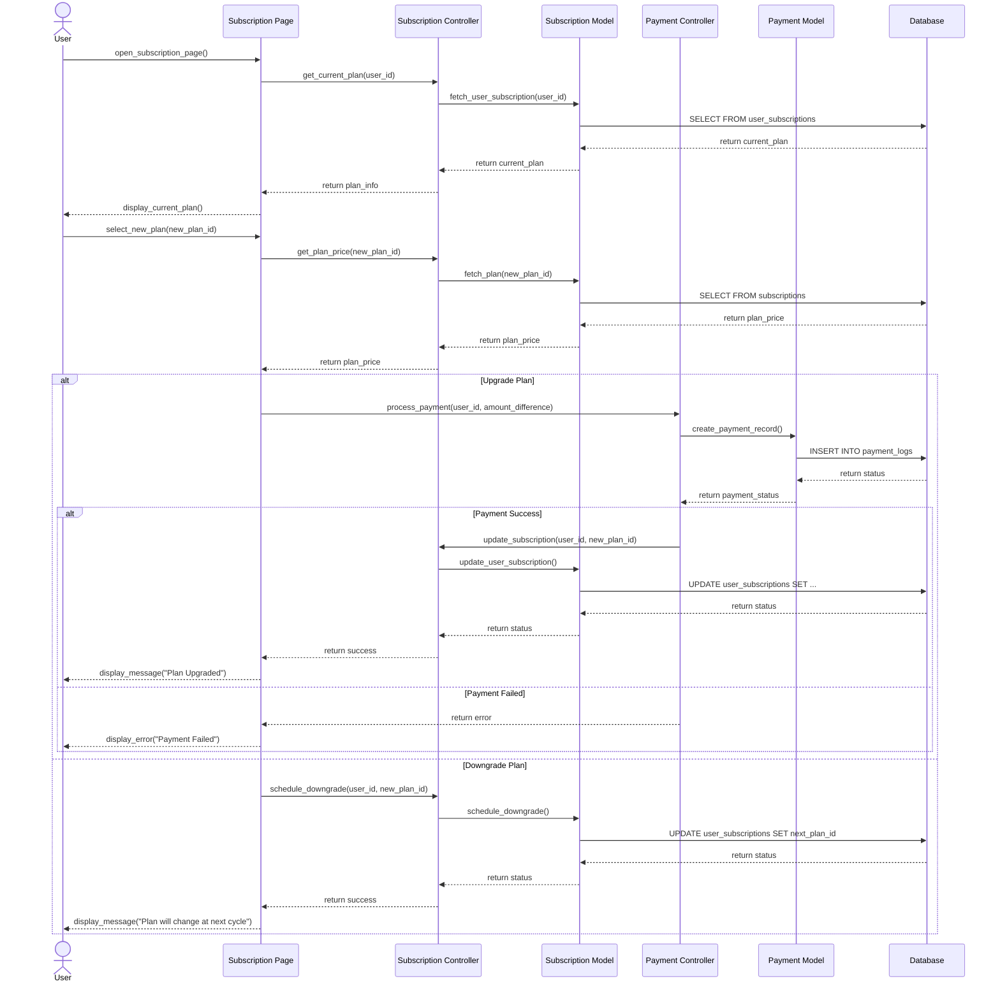
```mermaid
sequenceDiagram
    actor User
    participant SubPage as Subscription Page
    participant SubController as Subscription Controller
    participant SubModel as Subscription Model
    participant PaymentController as Payment Controller
    participant PaymentModel as Payment Model
    participant DB as Database

    User->>SubPage: open_subscription_page()
    SubPage->>SubController: get_current_plan(user_id)
    SubController->>SubModel: fetch_user_subscription(user_id)
    SubModel->>DB: SELECT FROM user_subscriptions
    DB-->>SubModel: return current_plan
    SubModel-->>SubController: return current_plan
    SubController-->>SubPage: return plan_info
    SubPage-->>User: display_current_plan()

    User->>SubPage: select_new_plan(new_plan_id)
    SubPage->>SubController: get_plan_price(new_plan_id)
    SubController->>SubModel: fetch_plan(new_plan_id)
    SubModel->>DB: SELECT FROM subscriptions
    DB-->>SubModel: return plan_price
    SubModel-->>SubController: return plan_price
    SubController-->>SubPage: return plan_price

    alt Upgrade Plan
        SubPage->>PaymentController: process_payment(user_id, amount_difference)
        PaymentController->>PaymentModel: create_payment_record()
        PaymentModel->>DB: INSERT INTO payment_logs
        DB-->>PaymentModel: return status
        PaymentModel-->>PaymentController: return payment_status
        alt Payment Success
            PaymentController->>SubController: update_subscription(user_id, new_plan_id)
            SubController->>SubModel: update_user_subscription()
            SubModel->>DB: UPDATE user_subscriptions SET ...
            DB-->>SubModel: return status
            SubModel-->>SubController: return status
            SubController-->>SubPage: return success
            SubPage-->>User: display_message("Plan Upgraded")
        else Payment Failed
            PaymentController-->>SubPage: return error
            SubPage-->>User: display_error("Payment Failed")
        end
    else Downgrade Plan
        SubPage->>SubController: schedule_downgrade(user_id, new_plan_id)
        SubController->>SubModel: schedule_downgrade()
        SubModel->>DB: UPDATE user_subscriptions SET next_plan_id
        DB-->>SubModel: return status
        SubModel-->>SubController: return status
        SubController-->>SubPage: return success
        SubPage-->>User: display_message("Plan will change at next cycle")
    end
```

---

#### 2.7.3 Cancel Subscription

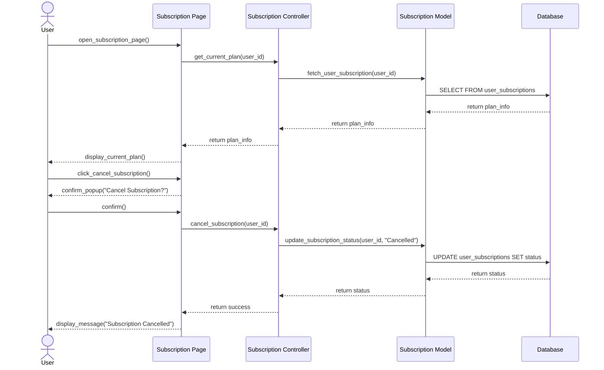
```mermaid
sequenceDiagram
    actor User
    participant SubPage as Subscription Page
    participant SubController as Subscription Controller
    participant SubModel as Subscription Model
    participant DB as Database

    User->>SubPage: open_subscription_page()
    SubPage->>SubController: get_current_plan(user_id)
    SubController->>SubModel: fetch_user_subscription(user_id)
    SubModel->>DB: SELECT FROM user_subscriptions
    DB-->>SubModel: return plan_info
    SubModel-->>SubController: return plan_info
    SubController-->>SubPage: return plan_info
    SubPage-->>User: display_current_plan()

    User->>SubPage: click_cancel_subscription()
    SubPage-->>User: confirm_popup("Cancel Subscription?")
    User->>SubPage: confirm()
    SubPage->>SubController: cancel_subscription(user_id)
    SubController->>SubModel: update_subscription_status(user_id, "Cancelled")
    SubModel->>DB: UPDATE user_subscriptions SET status
    DB-->>SubModel: return status
    SubModel-->>SubController: return status
    SubController-->>SubPage: return success
    SubPage-->>User: display_message("Subscription Cancelled")
```

---

## 3. Test Cases — System Testing

### TC-AUTH — Authentication

| ID         | Test Case                          | Precondition                 | Steps                                                        | Expected Result                                          | Priority |
| ---------- | ---------------------------------- | ---------------------------- | ------------------------------------------------------------ | -------------------------------------------------------- | -------- |
| TC-AUTH-01 | Register with valid data           | No existing account          | POST `/auth/register` with valid email & password (≥6 chars) | 201, `user_id` returned, password stored as bcrypt hash  | High     |
| TC-AUTH-02 | Register with duplicate email      | Email already exists in DB   | POST `/auth/register` with same email                        | 400 / 409 / 500 error                                    | High     |
| TC-AUTH-03 | Register with invalid email format | —                            | POST with `"email": "not-an-email"`                          | 422 Unprocessable Entity                                 | Medium   |
| TC-AUTH-04 | Register with short password       | —                            | POST with password < 6 chars                                 | 422 Validation Error                                     | Medium   |
| TC-AUTH-05 | Login with correct credentials     | User registered (TC-AUTH-01) | POST `/auth/login` with correct email/password               | 200, JWT `access_token` returned, `token_type: "bearer"` | High     |
| TC-AUTH-06 | Login with wrong password          | User registered              | POST with wrong password                                     | 401 Unauthorized                                         | High     |
| TC-AUTH-07 | Login with non-existent email      | —                            | POST with unknown email                                      | 401 Unauthorized                                         | High     |
| TC-AUTH-08 | Access `/auth/me` with valid JWT   | User logged in               | GET `/auth/me` with `Authorization: Bearer <token>`          | 200, user info returned                                  | High     |
| TC-AUTH-09 | Access `/auth/me` without JWT      | —                            | GET `/auth/me` (no header)                                   | 401 / 403 Unauthorized                                   | High     |
| TC-AUTH-10 | Access `/auth/me` with expired JWT | JWT past expiry              | GET `/auth/me` with expired token                            | 401 Unauthorized                                         | Medium   |
| TC-AUTH-11 | JWT contains correct claims        | User logged in               | Decode JWT from login response                               | Payload has `user_id`, `email`, `exp` (~7 days)          | Medium   |

---

### TC-TOKEN — Token Management

| ID        | Test Case                           | Precondition                     | Steps                                                                     | Expected Result                                    | Priority |
| --------- | ----------------------------------- | -------------------------------- | ------------------------------------------------------------------------- | -------------------------------------------------- | -------- |
| TC-TOK-01 | Create API token                    | User with active subscription    | POST `/tokens` `{ user_id, service_type:"API", token_name, expire_time }` | 200, `key` (UUID) returned, `service_type = "API"` | High     |
| TC-TOK-02 | Create VIDEO_WEBSOCKET token        | User with subscription           | POST `/tokens` with `service_type: "VIDEO_WEBSOCKET"`                     | 200, token with correct service_type               | High     |
| TC-TOK-03 | Create RTSP token                   | User with subscription           | POST `/tokens` with `service_type: "RTSP"`                                | 200, token with correct service_type               | High     |
| TC-TOK-04 | Default expiry = 30 days            | —                                | POST `/tokens` with `expire_time: null`                                   | 200, `expire_time` ≈ now + 30 days                 | Medium   |
| TC-TOK-05 | Get tokens filtered by service_type | Tokens of multiple types exist   | GET `/tokens/{user_id}?service_type=API`                                  | 200, array only contains `service_type = "API"`    | High     |
| TC-TOK-06 | Delete token                        | Token exists                     | DELETE `/tokens` `{ key: "<token_key>" }`                                 | 200, token no longer retrievable via GET           | High     |
| TC-TOK-07 | Update token name/expiry            | Token exists                     | PUT `/tokens` `{ key, token_name, expire_time }`                          | 200, updated token data returned                   | Medium   |
| TC-TOK-08 | Token limit enforcement             | User at subscription token limit | POST `/tokens` beyond limit                                               | 403 / 400 error                                    | High     |
| TC-TOK-09 | Token usage per hour                | Tokens used for requests         | POST `/tokens_usage_per_hour` `{ user_id, service_type }`                 | 200, list of `{ hour, count }`                     | Medium   |
| TC-TOK-10 | Get tokens for wrong user           | Tokens belong to user A          | GET `/tokens/{userB_id}?service_type=API`                                 | 200, empty array                                   | Medium   |

---

### TC-IMAGE — Image Upload & Recognition

| ID        | Test Case                            | Precondition                  | Steps                                                          | Expected Result                                                                   | Priority |
| --------- | ------------------------------------ | ----------------------------- | -------------------------------------------------------------- | --------------------------------------------------------------------------------- | -------- |
| TC-IMG-01 | Upload image with valid API token    | Active API token, quota > 0   | POST `/images/upload-image` multipart with valid `X-API-Token` | 200, `{ plate_id, province, full_plate, format_flag }`                            | High     |
| TC-IMG-02 | Upload without token                 | —                             | POST without `X-API-Token` header                              | 401 Unauthorized                                                                  | High     |
| TC-IMG-03 | Upload with invalid token            | —                             | POST with random string as token                               | 401 Unauthorized                                                                  | High     |
| TC-IMG-04 | Upload with wrong service_type token | VIDEO_WEBSOCKET token used    | POST with `service_type=VIDEO_WEBSOCKET` token                 | 401 / 403 Unauthorized                                                            | High     |
| TC-IMG-05 | Quota deducted after successful call | Token quota = N               | POST successful image upload                                   | Token quota becomes N-1 in DB                                                     | High     |
| TC-IMG-06 | Upload when quota = 0                | Token quota exhausted         | POST image                                                     | 403 Quota exceeded                                                                | High     |
| TC-IMG-07 | Upload expired token                 | Token expiry date in the past | POST image                                                     | 401 Token expired                                                                 | High     |
| TC-IMG-08 | Upload file > 10 MB                  | —                             | POST with 11 MB image                                          | 413 Request Entity Too Large                                                      | Medium   |
| TC-IMG-09 | Upload non-image file                | —                             | POST with `.txt` or `.pdf` file                                | 400 / 422 Bad Request                                                             | Medium   |
| TC-IMG-10 | Valid response structure             | Valid upload                  | Check response JSON                                            | Contains all required fields: `plate_id`, `province`, `full_plate`, `format_flag` | High     |
| TC-IMG-11 | Log stored after recognition         | Valid upload                  | Query `image_logs` in DB                                       | New row with correct `token_id`, `plate_id`, `timestamp`                          | High     |

---

### TC-VIDEO — WebSocket Video Streaming

| ID        | Test Case                                | Precondition                 | Steps                                      | Expected Result                                                 | Priority |
| --------- | ---------------------------------------- | ---------------------------- | ------------------------------------------ | --------------------------------------------------------------- | -------- |
| TC-VID-01 | Connect with valid VIDEO_WEBSOCKET token | Active VIDEO_WEBSOCKET token | WS connect to `ws://host/ws/video/<token>` | WebSocket connection established (101 Switching Protocols)      | High     |
| TC-VID-02 | Connect with invalid token               | —                            | WS connect with unknown token              | Connection rejected (close code 4001)                           | High     |
| TC-VID-03 | Connect with API-type token              | API token (wrong type)       | WS connect using API token in path         | Connection rejected                                             | High     |
| TC-VID-04 | Send frame and receive result            | WS connected                 | Send JPEG binary frame (≤5 MB)             | JSON response `{ plate_id, province, full_plate, format_flag }` | High     |
| TC-VID-05 | Frame too large                          | WS connected                 | Send frame > 5 MB                          | Connection closed with appropriate error code                   | Medium   |
| TC-VID-06 | Multiple frames in sequence              | WS connected                 | Send 10 frames at 1 fps                    | 10 independent JSON results received without error              | High     |
| TC-VID-07 | Graceful disconnect                      | WS connected                 | Client closes connection                   | Server cleans up task, no memory leak                           | Medium   |
| TC-VID-08 | Concurrent connections                   | Multiple tokens active       | 10 clients simultaneously stream           | All 10 connections receive independent results                  | Medium   |

---

### TC-RTSP — RTSP Stream Management

| ID         | Test Case                       | Precondition                       | Steps                                       | Expected Result                                        | Priority |
| ---------- | ------------------------------- | ---------------------------------- | ------------------------------------------- | ------------------------------------------------------ | -------- |
| TC-RTSP-01 | Add RTSP stream                 | User authenticated                 | POST `/streams` `{ name, rtsp_url }`        | 201, `{ stream_id, name, status:"stopped" }`           | High     |
| TC-RTSP-02 | Get all streams                 | Streams exist                      | GET `/streams`                              | 200, array of stream objects                           | High     |
| TC-RTSP-03 | Start stream                    | Stream in "stopped" state          | POST `/streams/{id}/start`                  | 200, status changes to "running"; capture task spawned | High     |
| TC-RTSP-04 | start already-running stream    | Stream already "running"           | POST `/streams/{id}/start` again            | 400 / 409 already running                              | Medium   |
| TC-RTSP-05 | Stop stream                     | Stream "running"                   | POST `/streams/{id}/stop`                   | 200, status changes to "stopped"; task cancelled       | High     |
| TC-RTSP-06 | Detection event logged          | Stream running, camera shows plate | Wait for detection cycle                    | Row inserted into detection_logs with plate data       | High     |
| TC-RTSP-07 | Web Viewer WebSocket            | Stream running                     | WS connect `ws://host/api/rtsp/stream/{id}` | Receives JPEG frames + overlay                         | Medium   |
| TC-RTSP-08 | Delete stream                   | Stream stopped                     | DELETE `/streams/{id}`                      | 200, stream removed from DB                            | High     |
| TC-RTSP-09 | Invalid RTSP URL                | —                                  | POST `/streams` with bad URL                | Stream created but fails gracefully on start           | Medium   |
| TC-RTSP-10 | Service restart resumes streams | DB has active streams              | Restart RTSP service                        | `startup_rtsp()` re-attaches active stream tasks       | Medium   |

---

### TC-SUB — Subscription Management

| ID        | Test Case                                | Precondition                 | Steps                                                               | Expected Result                                                       | Priority |
| --------- | ---------------------------------------- | ---------------------------- | ------------------------------------------------------------------- | --------------------------------------------------------------------- | -------- |
| TC-SUB-01 | Get all subscription plans               | Plans seeded in DB           | GET `/subscription/get_all_service`                                 | 200, list of Tier plans with `api_request_limit`, `token_limit`, etc. | High     |
| TC-SUB-02 | Purchase valid subscription              | User registered, plan exists | POST `/subscription/create_user_subscription` `{ user_id, sub_id }` | 200, subscription activated with `start_date` and `end_date`          | High     |
| TC-SUB-03 | Purchase invalid plan                    | —                            | POST with non-existent `sub_id`                                     | 404 Plan not found                                                    | Medium   |
| TC-SUB-04 | Purchase for non-existent user           | —                            | POST with invalid `user_id`                                         | 404 User not found                                                    | Medium   |
| TC-SUB-05 | View active subscription                 | User has subscription        | GET `/info/subscribe/{user_id}`                                     | 200, subscription details including quota and expiry                  | High     |
| TC-SUB-06 | Subscription quota limits token creation | Token limit = 3              | Create 4th token                                                    | 400 / 403 error                                                       | High     |
| TC-SUB-07 | Subscription quota limits API calls      | `api_request_limit` = 100    | Make 101st API call                                                 | 403 Quota exceeded                                                    | High     |
| TC-SUB-08 | Subscription with API access flag        | `has_api_access = false`     | Attempt image upload                                                | 403 Forbidden                                                         | Medium   |

---

### TC-AI — AI Plate Recognizer

| ID       | Test Case                      | Precondition       | Steps                                                        | Expected Result                                                                                   | Priority |
| -------- | ------------------------------ | ------------------ | ------------------------------------------------------------ | ------------------------------------------------------------------------------------------------- | -------- |
| TC-AI-01 | Health check endpoint          | Service running    | GET `/readyz`                                                | 200, `{ message:"service is ready", cuda:<bool> }`                                                | High     |
| TC-AI-02 | Process clear Thai plate image | Service running    | POST `/api/v1/image/process` with clear plate image          | `format_flag = "complete"`, `plate_id` non-empty, `province` non-empty                            | High     |
| TC-AI-03 | Process image with no plate    | Service running    | POST with plain car photo (no visible plate)                 | `plate_id = null` or `format_flag = "no_plate"`                                                   | High     |
| TC-AI-04 | Skip car detection endpoint    | Service running    | POST `/api/v1/image/process/skip/car` with plate-region crop | Skips YOLOv11s step, still returns plate_id/province                                              | Medium   |
| TC-AI-05 | From-plate-crop endpoint       | Service running    | POST `/api/v1/image/process/from-plate-crop`                 | Returns plate_id/province from pre-cropped plate                                                  | Medium   |
| TC-AI-06 | Inference time performance     | Service running    | POST 10 sequential requests                                  | Average response ≤ 200 ms per request                                                             | Medium   |
| TC-AI-07 | Load balanced requests         | 2 replicas running | POST 20 concurrent requests                                  | Requests distributed across both replicas; all succeed                                            | Medium   |
| TC-AI-08 | Response structure validation  | Service running    | Inspect JSON response                                        | Contains `car_bbox`, `plate_bbox`, `plate_id`, `province`, `full_plate`, `format_flag`, `message` | High     |
| TC-AI-09 | Blurry / low-res image         | Service running    | POST with 50×30 px image                                     | Graceful response (no crash), `format_flag` reflects partial/fail                                 | Medium   |
| TC-AI-10 | Large image (10 MB)            | Service running    | POST with 10 MB JPEG                                         | Successful processing or 413 if over limit, no service crash                                      | Low      |

---

## Summary

| Category                   | Use Cases    | Sequence Diagrams | Test Cases |
| -------------------------- | ------------ | ----------------- | ---------- |
| Authentication             | 3            | 2                 | 11         |
| Token Management           | 7            | 3                 | 10         |
| Image Recognition          | 5            | 2                 | 11         |
| Video Streaming            | 3            | 2                 | 8          |
| RTSP Camera Management     | 4            | 5                 | 10         |
| Subscription Management    | 4            | 3                 | 8          |
| AI Engine                  | — (internal) | —                 | 10         |
| **Total**                  | **26**       | **17**            | **68**     |
